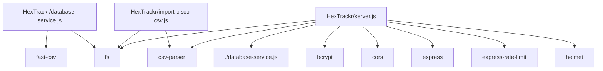

# HexTrackr — Comprehensive Code Review

_Generated: 2025-08-22T16:06:19_

**Files scanned (app code):** 80

## Table of Contents

- [Overview](#overview)
- [Project Inventory](#project-inventory)
- [Dependencies](#dependencies)
- [Build & Scripts](#build--scripts)
- [Module Import Graph](#module-import-graph)
- [Function Call Graph](#function-call-graph)
- [Event & Network Map](#event--network-map)
- [Per-File Function Catalog](#per-file-function-catalog)
- [Cross-Reference Index](#cross-reference-index)
- [Refactoring & Simplification Ideas](#refactoring--simplification-ideas)

---

## Overview

This document was generated by static analysis of the uploaded project (excluding vendor/build output). It catalogs functions/classes, dependencies, imports, a heuristic call graph, and an event map. Use it to quickly find where things are defined and referenced.

## Project Inventory

### `HexTrackr`
- DOCKER_SETUP.md
- DOCKER_TROUBLESHOOTING.md
- FINDINGS_ANALYSIS.md
- INTEGRATION_WORKFLOW.md
- PLATFORM_ARCHITECTURE.md
- README.md
- ROADMAP.md
- SECURITY_DOCUMENTATION.md
- TURSO_INTEGRATION.md
- TURSO_SETUP.md
- UPDATES_SUMMARY.md
- VERSION_CONTROL.md
- WORKING_SESSION_CONTEXT.json
- app.js
- cisco-api-service-enhanced.js
- cisco-api-service.js
- cisco-api-test.js
- database-service.js
- dnac-api-service.js
- docker-compose-new.yml
- docker-compose.new.yml
- docker-compose.prod.yml
- docker-compose.yml
- import-cisco-csv.js
- index.html
- integration-service.js
- package-lock.json
- package.json
- server.js
- servicenow-api-service.js
- servicenow-api.js
- styles.css
- tenable-vpr-service.js
- test-functions.html
- tickets.html
- unified-design-system.css
- vulnerabilities.html

### `HexTrackr/HexTrackr`
- app.js

### `HexTrackr/deprecated`
- README.md

### `HexTrackr/playbooks`
- vulnerability_remediation.yml

### `__MACOSX/HexTrackr`
- ._DOCKER_SETUP.md
- ._DOCKER_TROUBLESHOOTING.md
- ._FINDINGS_ANALYSIS.md
- ._INTEGRATION_WORKFLOW.md
- ._PLATFORM_ARCHITECTURE.md
- ._README.md
- ._ROADMAP.md
- ._SECURITY_DOCUMENTATION.md
- ._TURSO_INTEGRATION.md
- ._TURSO_SETUP.md
- ._UPDATES_SUMMARY.md
- ._VERSION_CONTROL.md
- ._WORKING_SESSION_CONTEXT.json
- ._app.js
- ._cisco-api-service-enhanced.js
- ._cisco-api-service.js
- ._cisco-api-test.js
- ._database-service.js
- ._dnac-api-service.js
- ._docker-compose-new.yml
- ._docker-compose.new.yml
- ._docker-compose.prod.yml
- ._docker-compose.yml
- ._import-cisco-csv.js
- ._index.html
- ._integration-service.js
- ._package-lock.json
- ._package.json
- ._server.js
- ._servicenow-api-service.js
- ._servicenow-api.js
- ._styles.css
- ._tenable-vpr-service.js
- ._test-functions.html
- ._tickets.html
- ._unified-design-system.css
- ._vulnerabilities.html

### `__MACOSX/HexTrackr/HexTrackr`
- ._app.js

### `__MACOSX/HexTrackr/deprecated`
- ._README.md

### `__MACOSX/HexTrackr/playbooks`
- ._vulnerability_remediation.yml

## Dependencies

_No package.json dependencies found._

## Build & Scripts

_No npm scripts found._

## Module Import Graph

_Approximate graph of files to the packages/modules they import (capped for readability). Render this Mermaid diagram in a Markdown viewer that supports Mermaid._

_Edges: 12, Nodes: 12_

## Function Call Graph

_Heuristic call relationships inferred by scanning for `identifier(` usages within other function bodies (capped for readability)._ 

```mermaid

flowchart LR
  b31061cc["setupEventListeners"] --> a5fd8968["showVulnDetails"]
  8a567a51["handleFileUpload"] --> fb00fa70["processFileSimple"]
  9e7d4949["loadSampleData"] --> ffaeecfe["updateCardViews"]
  cfe798e7["processVulnData"] --> 5a5957cb["saveToHistory"]
  dc92a1e1["checkForDeviceFilter"] --> dd6b2879["showToast"]
  1436c853["finalizeBatchProcessing"] --> a788f141["updateStatCards"]
  1cc6d561["loadTickets"] --> ae022a13["updateStatistics"]
  85abe1b5["uploadCsvToAPI"] --> fb00fa70["processFileSimple"]
  5076871b["parseDate"] --> e8dd8521["importCiscoCSV"]
  b31061cc["setupEventListeners"] --> f1f75157["deleteAsset"]
  e9df5ff4["exportData"] --> 315be71b["exportToCSV"]
  b31061cc["setupEventListeners"] --> ae787449["deleteVulnerability"]
  a788f141["updateStatCards"] --> b2a5b7c6["updateChangeIndicator"]
  2743d4ef["initializeApp"] --> b2fd32cc["checkRequiredLibraries"]
  ec59379e["renderTickets"] --> 89abc74a["formatDevicesWithLinks"]
  c8022d91["processVulnerabilityData"] --> 6630c00b["storeVulnerabilityData"]
  84b9640a["filterAndDisplayData"] --> 1519f9ad["getAssetTicketStatus"]
  c8022d91["processVulnerabilityData"] --> a788f141["updateStatCards"]
  c4ab7d69["applySorting"] --> 1519f9ad["getAssetTicketStatus"]
  1cc6d561["loadTickets"] --> b9faf8f4["initializeSampleData"]
  f542a890["sortTable"] --> ec59379e["renderTickets"]
  09732af4["updateTicketsWithVulnerabilityData"] --> 5e531fd8["editTicket"]
  7a02d2c7["saveSettings"] --> 5e531fd8["editTicket"]
  9bd9e10d["syncCiscoVulnerabilities"] --> 84b9640a["filterAndDisplayData"]
  cc3ddea0["updateAssetCards"] --> 126b89df["createPagination"]
  e8dd8521["importCiscoCSV"] --> 2957bc51["mapSeverity"]
  92679854["exportToJSON"] --> ed0291d4["showNotification"]
  ffaeecfe["updateCardViews"] --> cc3ddea0["updateAssetCards"]
  33e10060["decryptData"] --> 6443fbf5["getEncryptionKey"]
  b31061cc["setupEventListeners"] --> 2a462d6a["setupButtonHandlers"]
  f04036e6["handleCsvImport"] --> 1e21d460["parseCSV"]
  6e234452["processWithLocalStorage"] --> cfe798e7["processVulnData"]
  2a462d6a["setupButtonHandlers"] --> 457fab2e["updatePagination"]
  fb00fa70["processFileSimple"] --> c8022d91["processVulnerabilityData"]
  feaf2285["refreshData"] --> 3cc3519b["loadExistingData"]
  b31061cc["setupEventListeners"] --> 67fc068c["editVulnerability"]
  5198371b["createVulnCard"] --> a5fd8968["showVulnDetails"]
  ec59379e["renderTickets"] --> 4c883b75["getStatusBadgeClass"]
  cc8929a5["createTicketFromVulnerability"] --> 1cc6d561["loadTickets"]
  cfe798e7["processVulnData"] --> 1b0fb5df["updateLastUploadInfo"]
  b31061cc["setupEventListeners"] --> 84b9640a["filterAndDisplayData"]
  2c20735b["testCiscoAPI"] --> 036835d9["quickLogin"]
  15e3cbae["showAPIModal"] --> 11559076["showToolsModal"]
  92679854["exportToJSON"] --> f300a023["downloadFile"]
  7a02d2c7["saveSettings"] --> 87655e8c["deleteTicket"]
  c8022d91["processVulnerabilityData"] --> a6778ca2["saveHistoricalData"]
  e1a9e596["createAssetCard"] --> d897fae7["showAssetDetails"]
  11559076["showToolsModal"] --> e2014169["loadCiscoCredentials"]
  441289ad["mapSeverityToScore"] --> 32a9a51d["mapCiscoSeverity"]
  84b9640a["filterAndDisplayData"] --> ffaeecfe["updateCardViews"]
  5e531fd8["editTicket"] --> ae022a13["updateStatistics"]
  5e531fd8["editTicket"] --> ed0291d4["showNotification"]
  cfe798e7["processVulnData"] --> 324cebf0["calculateStatistics"]
  c8022d91["processVulnerabilityData"] --> 324cebf0["calculateStatistics"]
  140b2246["updateVulnCards"] --> 126b89df["createPagination"]
  e2014169["loadCiscoCredentials"] --> 33e10060["decryptData"]
  e9df5ff4["exportData"] --> ed0291d4["showNotification"]
  cfe798e7["processVulnData"] --> a788f141["updateStatCards"]
  e1a9e596["createAssetCard"] --> f1f75157["deleteAsset"]
  15e3cbae["showAPIModal"] --> e2014169["loadCiscoCredentials"]
  2743d4ef["initializeApp"] --> ae022a13["updateStatistics"]
  87655e8c["deleteTicket"] --> 457fab2e["updatePagination"]
  e8dd8521["importCiscoCSV"] --> e5b4fdfd["insertBatch"]
  c16a33f7["clearAPICredentials"] --> 33e10060["decryptData"]
  ffaeecfe["updateCardViews"] --> ec915da5["updateTableView"]
  e1a9e596["createAssetCard"] --> 1519f9ad["getAssetTicketStatus"]
  1436c853["finalizeBatchProcessing"] --> 84b9640a["filterAndDisplayData"]
  5198371b["createVulnCard"] --> 67fc068c["editVulnerability"]
  200a2176["clearSampleDataFromStorage"] --> b31061cc["setupEventListeners"]
  200a2176["clearSampleDataFromStorage"] --> 11dd9484["initializeSortable"]
  b31061cc["setupEventListeners"] --> cc3ddea0["updateAssetCards"]
  8a567a51["handleFileUpload"] --> cfe798e7["processVulnData"]
  1cc6d561["loadTickets"] --> ec59379e["renderTickets"]
  5e531fd8["editTicket"] --> ec59379e["renderTickets"]
  200a2176["clearSampleDataFromStorage"] --> 3cc3519b["loadExistingData"]
  b31061cc["setupEventListeners"] --> 1049686f["editAsset"]
  cc8929a5["createTicketFromVulnerability"] --> 100ecc72["checkForHighlightedTicket"]
  87655e8c["deleteTicket"] --> ae022a13["updateStatistics"]
  87655e8c["deleteTicket"] --> ed0291d4["showNotification"]
  9bd9e10d["syncCiscoVulnerabilities"] --> 32a9a51d["mapCiscoSeverity"]
  580cda9b["submitNewTicket"] --> ae022a13["updateStatistics"]
  580cda9b["submitNewTicket"] --> ed0291d4["showNotification"]
  3cc3519b["loadExistingData"] --> 324cebf0["calculateStatistics"]
  6e7724b6["createTableRow"] --> ae787449["deleteVulnerability"]
  f542a890["sortTable"] --> 7690977f["updateSortIndicators"]
  2a462d6a["setupButtonHandlers"] --> 70416a65["openExternalLink"]
  e9df5ff4["exportData"] --> 1519f9ad["getAssetTicketStatus"]
  df6bc7b4["processFileClientSideOld"] --> 77a856cc["mapCSVRow"]
  b31061cc["setupEventListeners"] --> 631cd5f1["setupTableHandlers"]
  09732af4["updateTicketsWithVulnerabilityData"] --> e9df5ff4["exportData"]
  cfe798e7["processVulnData"] --> ffaeecfe["updateCardViews"]
  9efb21de["goToVulnPage"] --> 140b2246["updateVulnCards"]
  a54d4d39["processFileClientSide"] --> c2c08b3a["loadVulnerabilitiesFromAPI"]
  ec915da5["updateTableView"] --> 6e7724b6["createTableRow"]
  7a02d2c7["saveSettings"] --> e9df5ff4["exportData"]
  df6bc7b4["processFileClientSideOld"] --> 38b8caf8["hideUploadProgress"]
  c8022d91["processVulnerabilityData"] --> dd6b2879["showToast"]
  3cc3519b["loadExistingData"] --> a788f141["updateStatCards"]
  5e531fd8["editTicket"] --> 6128d0da["saveTickets"]
  ec59379e["renderTickets"] --> 5dea645a["updatePaginationInfo"]
  cc3ddea0["updateAssetCards"] --> e1a9e596["createAssetCard"]
  a80b11cf["authenticateToken"] --> 90257dc5["processBatch"]
  140b2246["updateVulnCards"] --> 5198371b["createVulnCard"]
  c16a33f7["clearAPICredentials"] --> ae022a13["updateStatistics"]
  9bd9e10d["syncCiscoVulnerabilities"] --> 441289ad["mapSeverityToScore"]
  9bd9e10d["syncCiscoVulnerabilities"] --> 33e10060["decryptData"]
  ffaeecfe["updateCardViews"] --> 140b2246["updateVulnCards"]
  fb00fa70["processFileSimple"] --> 38b8caf8["hideUploadProgress"]
  c8022d91["processVulnerabilityData"] --> 38b8caf8["hideUploadProgress"]
  2743d4ef["initializeApp"] --> 04e34623["loadSettings"]
  cfe798e7["processVulnData"] --> d1bb795c["processBatchVulnData"]
  33ad74a2["processFile"] --> 85abe1b5["uploadCsvToAPI"]
  e9df5ff4["exportData"] --> 9ba7cfba["exportToHTML"]
  b31061cc["setupEventListeners"] --> 8a567a51["handleFileUpload"]
  a54d4d39["processFileClientSide"] --> 38b8caf8["hideUploadProgress"]
  200a2176["clearSampleDataFromStorage"] --> 9e7d4949["loadSampleData"]
  100ecc72["checkForHighlightedTicket"] --> dd6b2879["showToast"]
  09732af4["updateTicketsWithVulnerabilityData"] --> f542a890["sortTable"]
  b31061cc["setupEventListeners"] --> ec915da5["updateTableView"]
  3aa46d43["openHexagonTicket"] --> cc8929a5["createTicketFromVulnerability"]
  5198371b["createVulnCard"] --> ae787449["deleteVulnerability"]
  7a02d2c7["saveSettings"] --> f542a890["sortTable"]
  2a462d6a["setupButtonHandlers"] --> ec59379e["renderTickets"]
  200a2176["clearSampleDataFromStorage"] --> c2c08b3a["loadVulnerabilitiesFromAPI"]
  e8dd8521["importCiscoCSV"] --> e6eead2d["mapStatus"]
  6e7724b6["createTableRow"] --> a5fd8968["showVulnDetails"]
  78c70541["processLargeCsvViaAPI"] --> fb00fa70["processFileSimple"]
  1436c853["finalizeBatchProcessing"] --> 5a5957cb["saveToHistory"]
  00d7317c["applyTicketFilter"] --> 1519f9ad["getAssetTicketStatus"]
  ae787449["deleteVulnerability"] --> ffaeecfe["updateCardViews"]
  f1f75157["deleteAsset"] --> ffaeecfe["updateCardViews"]
  b31061cc["setupEventListeners"] --> d897fae7["showAssetDetails"]
  c16a33f7["clearAPICredentials"] --> c4ab7d69["applySorting"]
  457fab2e["updatePagination"] --> 6d41aaeb["changePage"]
  df6bc7b4["processFileClientSideOld"] --> 71c7e859["showUploadProgress"]
  feaf2285["refreshData"] --> ffaeecfe["updateCardViews"]
  feaf2285["refreshData"] --> dd6b2879["showToast"]
  3cc3519b["loadExistingData"] --> ffaeecfe["updateCardViews"]
  e1a9e596["createAssetCard"] --> 1049686f["editAsset"]
  b31061cc["setupEventListeners"] --> 2aa9fcc2["setupModalHandlers"]
  575727d5["encryptData"] --> 6443fbf5["getEncryptionKey"]
  6d41aaeb["changePage"] --> ec59379e["renderTickets"]
  200a2176["clearSampleDataFromStorage"] --> dc92a1e1["checkForDeviceFilter"]
  9ba7cfba["exportToHTML"] --> ed0291d4["showNotification"]
  ec915da5["updateTableView"] --> 126b89df["createPagination"]
  e9df5ff4["exportData"] --> 526561a8["exportToExcel"]
  37957423["exportToPDF"] --> ed0291d4["showNotification"]
  9e7d4949["loadSampleData"] --> 324cebf0["calculateStatistics"]
  90257dc5["processBatch"] --> 1436c853["finalizeBatchProcessing"]
  c8022d91["processVulnerabilityData"] --> 84013c97["updateDataStatus"]
  fb00fa70["processFileSimple"] --> 71c7e859["showUploadProgress"]
  70416a65["openExternalLink"] --> ed0291d4["showNotification"]
  a788f141["updateStatCards"] --> baac4efd["createSeveritySparkline"]
  e1a9e596["createAssetCard"] --> bbbafd1a["getTicketIndicator"]
  295a8f67["saveCiscoCredentials"] --> 575727d5["encryptData"]
  a54d4d39["processFileClientSide"] --> 71c7e859["showUploadProgress"]
  9e7d4949["loadSampleData"] --> a788f141["updateStatCards"]
  a54d4d39["processFileClientSide"] --> dd6b2879["showToast"]
  9ba7cfba["exportToHTML"] --> f300a023["downloadFile"]
  f04036e6["handleCsvImport"] --> ae022a13["updateStatistics"]
  f04036e6["handleCsvImport"] --> ed0291d4["showNotification"]
  ec59379e["renderTickets"] --> 5e531fd8["editTicket"]
  11559076["showToolsModal"] --> ee1c44b7["loadDatabaseConfig"]
  c16a33f7["clearAPICredentials"] --> e8bc042e["debounce"]
  cc8929a5["createTicketFromVulnerability"] --> 09732af4["updateTicketsWithVulnerabilityData"]
  574eced9["toggleUploadArea"] --> fa0d9939["updateTrendChart"]
  87655e8c["deleteTicket"] --> ec59379e["renderTickets"]
  fa0d9939["updateTrendChart"] --> 324cebf0["calculateStatistics"]
  4b53a848["saveVulnChanges"] --> ffaeecfe["updateCardViews"]
  6e7724b6["createTableRow"] --> 67fc068c["editVulnerability"]
  4947e349["goToAssetPage"] --> cc3ddea0["updateAssetCards"]
  b31061cc["setupEventListeners"] --> 140b2246["updateVulnCards"]
  580cda9b["submitNewTicket"] --> ec59379e["renderTickets"]
  1436c853["finalizeBatchProcessing"] --> 1b0fb5df["updateLastUploadInfo"]
  c16a33f7["clearAPICredentials"] --> 84b9640a["filterAndDisplayData"]
  e9df5ff4["exportData"] --> 92679854["exportToJSON"]
  315be71b["exportToCSV"] --> ed0291d4["showNotification"]
  cd18a1fd["goToTablePage"] --> ec915da5["updateTableView"]
  5ac6d174["clearVulnData"] --> a788f141["updateStatCards"]
  e9df5ff4["exportData"] --> 37957423["exportToPDF"]
  df6bc7b4["processFileClientSideOld"] --> 3cc3519b["loadExistingData"]
  ec59379e["renderTickets"] --> 87655e8c["deleteTicket"]
  b31061cc["setupEventListeners"] --> 7a356bbc["setupFileHandlers"]
  ffacbb4f["getStorageInfo"] --> 4a10972f["clearStorageData"]
  249edca9["handleDocumentAttachment"] --> ed0291d4["showNotification"]
  f04036e6["handleCsvImport"] --> ec59379e["renderTickets"]
  526561a8["exportToExcel"] --> ed0291d4["showNotification"]
  09732af4["updateTicketsWithVulnerabilityData"] --> 87655e8c["deleteTicket"]
  e8dd8521["importCiscoCSV"] --> 5076871b["parseDate"]
  33ad74a2["processFile"] --> 38b8caf8["hideUploadProgress"]
  dab30016["saveAssetChanges"] --> ffaeecfe["updateCardViews"]
  1436c853["finalizeBatchProcessing"] --> 324cebf0["calculateStatistics"]
  e9df5ff4["exportData"] --> dd6b2879["showToast"]
  f542a890["sortTable"] --> ed0291d4["showNotification"]
  315be71b["exportToCSV"] --> f300a023["downloadFile"]
  c16a33f7["clearAPICredentials"] --> ffaeecfe["updateCardViews"]
  6d41aaeb["changePage"] --> 457fab2e["updatePagination"]
  b9faf8f4["initializeSampleData"] --> 6128d0da["saveTickets"]
  2743d4ef["initializeApp"] --> 457fab2e["updatePagination"]
  87655e8c["deleteTicket"] --> 6128d0da["saveTickets"]
  df6bc7b4["processFileClientSideOld"] --> d506b5e5["updateUploadProgress"]

```

_Edges: 201, Nodes: 124_

## Event & Network Map

| File | Line | Kind | Snippet |
|---|---:|---|---|
| `HexTrackr/HexTrackr/app.js` | 12 | `addEventListener` | `document.addEventListener('DOMContentLoaded', function() {` |
| `HexTrackr/HexTrackr/app.js` | 80 | `addEventListener` | `attachDocsBtn.addEventListener('click', function() {` |
| `HexTrackr/HexTrackr/app.js` | 86 | `addEventListener` | `importCsvBtn.addEventListener('click', function() {` |
| `HexTrackr/HexTrackr/app.js` | 92 | `addEventListener` | `sharedDocsInput.addEventListener('change', handleDocumentAttachment);` |
| `HexTrackr/HexTrackr/app.js` | 96 | `addEventListener` | `csvImportInput.addEventListener('change', handleCsvImport);` |
| `HexTrackr/HexTrackr/app.js` | 107 | `addEventListener` | `hexagonLink.addEventListener('click', function(e) {` |
| `HexTrackr/HexTrackr/app.js` | 114 | `addEventListener` | `serviceNowLink.addEventListener('click', function(e) {` |
| `HexTrackr/HexTrackr/app.js` | 123 | `addEventListener` | `rowsPerPageSelect.addEventListener('change', function() {` |
| `HexTrackr/HexTrackr/app.js` | 459 | `querySelector` | `const headers = document.querySelectorAll('.sortable-header');` |
| `HexTrackr/HexTrackr/app.js` | 470 | `localStorage` | `console.log('Loading tickets from localStorage...');` |
| `HexTrackr/HexTrackr/app.js` | 472 | `localStorage` | `const savedTickets = localStorage.getItem('hextrackr-tickets');` |
| `HexTrackr/HexTrackr/app.js` | 537 | `localStorage` | `localStorage.setItem('hextrackr-tickets', JSON.stringify(tickets));` |
| `HexTrackr/HexTrackr/app.js` | 714 | `setTimeout` | `setTimeout(() => {` |
| `HexTrackr/HexTrackr/app.js` | 723 | `localStorage` | `const savedSettings = localStorage.getItem('hextrackr-settings');` |
| `HexTrackr/HexTrackr/app.js` | 741 | `localStorage` | `localStorage.setItem('hextrackr-settings', JSON.stringify(settings));` |
| `HexTrackr/app.js` | 12 | `addEventListener` | `document.addEventListener('DOMContentLoaded', function() {` |
| `HexTrackr/app.js` | 80 | `addEventListener` | `attachDocsBtn.addEventListener('click', function() {` |
| `HexTrackr/app.js` | 86 | `addEventListener` | `importCsvBtn.addEventListener('click', function() {` |
| `HexTrackr/app.js` | 92 | `addEventListener` | `sharedDocsInput.addEventListener('change', handleDocumentAttachment);` |
| `HexTrackr/app.js` | 96 | `addEventListener` | `csvImportInput.addEventListener('change', handleCsvImport);` |
| `HexTrackr/app.js` | 107 | `addEventListener` | `hexagonLink.addEventListener('click', function(e) {` |
| `HexTrackr/app.js` | 114 | `addEventListener` | `serviceNowLink.addEventListener('click', function(e) {` |
| `HexTrackr/app.js` | 123 | `addEventListener` | `rowsPerPageSelect.addEventListener('change', function() {` |
| `HexTrackr/app.js` | 459 | `querySelector` | `const headers = document.querySelectorAll('.sortable-header');` |
| `HexTrackr/app.js` | 470 | `localStorage` | `console.log('Loading tickets from localStorage...');` |
| `HexTrackr/app.js` | 472 | `localStorage` | `const savedTickets = localStorage.getItem('hextrackr-tickets');` |
| `HexTrackr/app.js` | 537 | `localStorage` | `localStorage.setItem('hextrackr-tickets', JSON.stringify(tickets));` |
| `HexTrackr/app.js` | 737 | `setTimeout` | `setTimeout(() => {` |
| `HexTrackr/app.js` | 746 | `localStorage` | `const savedSettings = localStorage.getItem('hextrackr-settings');` |
| `HexTrackr/app.js` | 764 | `localStorage` | `localStorage.setItem('hextrackr-settings', JSON.stringify(settings));` |
| `HexTrackr/app.js` | 811 | `localStorage` | `localStorage.setItem('hextrackr_tickets', JSON.stringify(tickets));` |
| `HexTrackr/app.js` | 842 | `setTimeout` | `setTimeout(() => {` |
| `HexTrackr/app.js` | 845 | `setTimeout` | `setTimeout(() => {` |
| `HexTrackr/app.js` | 894 | `setTimeout` | `setTimeout(() => {` |
| `HexTrackr/app.js` | 895 | `querySelector` | `const ticketRow = document.querySelector(`tr[data-ticket-id="${highlightId}"]`);` |
| `HexTrackr/app.js` | 924 | `setTimeout` | `setTimeout(() => {` |
| `HexTrackr/app.js` | 925 | `querySelector` | `const newTicketRow = document.querySelector(`tr[data-ticket-id="${ticket.id}"]`);` |
| `HexTrackr/app.js` | 956 | `querySelector` | `const ticketRows = document.querySelectorAll('#ticketsTableBody tr');` |
| `HexTrackr/cisco-api-service-enhanced.js` | 42 | `setTimeout` | `await new Promise(resolve => setTimeout(resolve, waitTime));` |
| `HexTrackr/cisco-api-service-enhanced.js` | 55 | `localStorage` | `const encrypted = localStorage.getItem('hextrackr_cisco_credentials');` |
| `HexTrackr/cisco-api-service-enhanced.js` | 91 | `fetch` | `const response = await fetch(this.authUrl, {` |
| `HexTrackr/cisco-api-service-enhanced.js` | 131 | `fetch` | `const response = await fetch(`${this.baseUrl}/advisories/cvrf/cve/CVE-2023-20001`, {` |
| `HexTrackr/cisco-api-service-enhanced.js` | 165 | `fetch` | `return fetch(`${this.baseUrl}/advisories/oval?${params}`, {` |
| `HexTrackr/cisco-api-service-enhanced.js` | 196 | `fetch` | `return fetch(`${this.baseUrl}/advisories/cvrf/cve/${cveId}`, {` |
| `HexTrackr/cisco-api-service-enhanced.js` | 428 | `setTimeout` | `await new Promise(resolve => setTimeout(resolve, delay));` |
| `HexTrackr/cisco-api-service.js` | 42 | `setTimeout` | `await new Promise(resolve => setTimeout(resolve, waitTime));` |
| `HexTrackr/cisco-api-service.js` | 55 | `localStorage` | `const encrypted = localStorage.getItem('hextrackr_cisco_credentials');` |
| `HexTrackr/cisco-api-service.js` | 89 | `fetch` | `const response = await fetch(this.authUrl, {` |
| `HexTrackr/cisco-api-service.js` | 130 | `fetch` | `const response = await fetch(`${this.baseUrl}/advisories/v2/advisories?limit=1`, {` |
| `HexTrackr/cisco-api-service.js` | 178 | `fetch` | `return await fetch(url, {` |
| `HexTrackr/cisco-api-service.js` | 207 | `fetch` | `return await fetch(`${this.baseUrl}/advisories/v2/cve/${cveId}`, {` |
| `HexTrackr/cisco-api-service.js` | 379 | `setTimeout` | `await new Promise(resolve => setTimeout(resolve, parseInt(retryAfter) * 1000));` |
| `HexTrackr/cisco-api-service.js` | 389 | `setTimeout` | `await new Promise(resolve => setTimeout(resolve, this.retryDelay));` |
| `HexTrackr/cisco-api-service.js` | 426 | `localStorage` | `const existingData = JSON.parse(localStorage.getItem('hextrackr_vuln_data') \|\| '[]');` |
| `HexTrackr/cisco-api-service.js` | 430 | `localStorage` | `localStorage.setItem('hextrackr_vuln_data', JSON.stringify(mergedData));` |
| `HexTrackr/cisco-api-service.js` | 566 | `setTimeout` | `setTimeout(() => {` |
| `HexTrackr/cisco-api-test.js` | 12 | `fetch` | `const tokenResponse = await fetch('https://cloudsso.cisco.com/as/token.oauth2', {` |
| `HexTrackr/cisco-api-test.js` | 30 | `fetch` | `const advisoryResponse = await fetch('https://api.cisco.com/security/advisories/v2/all', {` |
| `HexTrackr/dnac-api-service.js` | 27 | `localStorage` | `const config = JSON.parse(localStorage.getItem('dnac_config') \|\| '{}');` |
| `HexTrackr/dnac-api-service.js` | 48 | `localStorage` | `localStorage.setItem('dnac_config', JSON.stringify(config));` |
| `HexTrackr/dnac-api-service.js` | 77 | `setTimeout` | `await new Promise(resolve => setTimeout(resolve, waitTime));` |
| `HexTrackr/dnac-api-service.js` | 99 | `fetch` | `const response = await fetch(authUrl, {` |
| `HexTrackr/dnac-api-service.js` | 163 | `fetch` | `const response = await fetch(url, options);` |
| `HexTrackr/index.html` | 1286 | `localStorage` | `localStorage.removeItem('hextrackr_vuln_data');` |
| `HexTrackr/index.html` | 1287 | `localStorage` | `localStorage.removeItem('vulnHistory');` |
| `HexTrackr/index.html` | 1288 | `localStorage` | `localStorage.removeItem('hextrackr_tickets');` |
| `HexTrackr/index.html` | 1295 | `localStorage` | `let historyData = JSON.parse(localStorage.getItem('vulnHistory') \|\| '[]');` |
| `HexTrackr/index.html` | 1314 | `addEventListener` | `document.addEventListener('DOMContentLoaded', async function() {` |
| `HexTrackr/index.html` | 1344 | `addEventListener` | `if (toolsButton) toolsButton.addEventListener('click', showToolsModal);` |
| `HexTrackr/index.html` | 1347 | `addEventListener` | `if (uploadCsvButton) uploadCsvButton.addEventListener('click', () => {` |
| `HexTrackr/index.html` | 1355 | `addEventListener` | `if (uploadJsonButton) uploadJsonButton.addEventListener('click', () => {` |
| `HexTrackr/index.html` | 1365 | `addEventListener` | `connectApisButton.addEventListener('click', (e) => {` |
| `HexTrackr/index.html` | 1372 | `addEventListener` | `if (selectFileButton) selectFileButton.addEventListener('click', () => document.getElementById('fileInput').click());` |
| `HexTrackr/index.html` | 1376 | `addEventListener` | `if (criticalCard) criticalCard.addEventListener('click', () => filterBySeverity('critical'));` |
| `HexTrackr/index.html` | 1379 | `addEventListener` | `if (highCard) highCard.addEventListener('click', () => filterBySeverity('high'));` |
| `HexTrackr/index.html` | 1382 | `addEventListener` | `if (mediumCard) mediumCard.addEventListener('click', () => filterBySeverity('medium'));` |
| `HexTrackr/index.html` | 1385 | `addEventListener` | `if (lowCard) lowCard.addEventListener('click', () => filterBySeverity('low'));` |
| `HexTrackr/index.html` | 1389 | `addEventListener` | `if (refreshButton) refreshButton.addEventListener('click', refreshData);` |
| `HexTrackr/index.html` | 1392 | `addEventListener` | `if (clearDataButton) clearDataButton.addEventListener('click', clearVulnData);` |
| `HexTrackr/index.html` | 1396 | `addEventListener` | `if (footerSettingsButton) footerSettingsButton.addEventListener('click', showToolsModal);` |
| `HexTrackr/index.html` | 1399 | `addEventListener` | `if (footerExportButton) footerExportButton.addEventListener('click', exportData);` |
| `HexTrackr/index.html` | 1402 | `addEventListener` | `if (footerRefreshButton) footerRefreshButton.addEventListener('click', refreshData);` |
| `HexTrackr/index.html` | 1406 | `addEventListener` | `if (exportButton) exportButton.addEventListener('click', exportData);` |
| `HexTrackr/index.html` | 1409 | `addEventListener` | `if (settingsButton) settingsButton.addEventListener('click', showToolsModal);` |
| `HexTrackr/index.html` | 1417 | `addEventListener` | `fileInput.addEventListener('change', handleFileUpload);` |
| `HexTrackr/index.html` | 1420 | `addEventListener` | `uploadArea.addEventListener('dragover', function(e) {` |
| `HexTrackr/index.html` | 1425 | `addEventListener` | `uploadArea.addEventListener('dragleave', function(e) {` |
| `HexTrackr/index.html` | 1430 | `addEventListener` | `uploadArea.addEventListener('drop', function(e) {` |
| `HexTrackr/index.html` | 1441 | `querySelector` | `document.querySelectorAll('input[name="viewMode"]').forEach(radio => {` |
| `HexTrackr/index.html` | 1442 | `addEventListener` | `radio.addEventListener('change', updateCardViews);` |
| `HexTrackr/index.html` | 1448 | `addEventListener` | `sortSelect.addEventListener('change', updateCardViews);` |
| `HexTrackr/index.html` | 1452 | `addEventListener` | `document.getElementById('assetItemsPerPage').addEventListener('change', function() {` |
| `HexTrackr/index.html` | 1458 | `addEventListener` | `document.getElementById('vulnItemsPerPage').addEventListener('change', function() {` |
| `HexTrackr/index.html` | 1465 | `addEventListener` | `document.getElementById('searchInput').addEventListener('input', function() {` |
| `HexTrackr/index.html` | 1469 | `addEventListener` | `document.getElementById('clearSearch').addEventListener('click', function() {` |
| `HexTrackr/index.html` | 1475 | `addEventListener` | `document.getElementById('severityFilter').addEventListener('change', function() {` |
| `HexTrackr/index.html` | 1480 | `addEventListener` | `document.getElementById('tableItemsPerPage').addEventListener('change', function() {` |
| `HexTrackr/index.html` | 1487 | `addEventListener` | `document.addEventListener('click', function(e) {` |
| `HexTrackr/index.html` | 1623 | `localStorage` | `const existingData = JSON.parse(localStorage.getItem('hextrackr_vulnerabilities') \|\| '[]');` |
| `HexTrackr/index.html` | 1630 | `localStorage` | `localStorage.setItem('hextrackr_vulnerabilities', JSON.stringify(mergedData));` |
| `HexTrackr/index.html` | 1631 | `localStorage` | `localStorage.setItem('hextrackr_last_import', new Date().toISOString());` |
| `HexTrackr/index.html` | 1632 | `localStorage` | `localStorage.setItem('hextrackr_total_count', mergedData.length);` |
| `HexTrackr/index.html` | 1686 | `querySelector` | `const totalElement = document.querySelector('[data-stat="total"]');` |
| `HexTrackr/index.html` | 1687 | `querySelector` | `const criticalElement = document.querySelector('[data-stat="critical"]');` |
| `HexTrackr/index.html` | 1688 | `querySelector` | `const highElement = document.querySelector('[data-stat="high"]');` |
| `HexTrackr/index.html` | 1689 | `querySelector` | `const openElement = document.querySelector('[data-stat="open"]');` |
| `HexTrackr/index.html` | 1722 | `fetch` | `const response = await fetch('/api/import/upload-csv', {` |
| `HexTrackr/index.html` | 1813 | `localStorage` | `alert('⚠️ File too large for localStorage. Please use a smaller dataset or enable SQLite.');` |
| `HexTrackr/index.html` | 1976 | `querySelector` | `const backdrop = document.querySelector('.modal-backdrop');` |
| `HexTrackr/index.html` | 2084 | `localStorage` | `localStorage.setItem('hextrackr_vuln_data', JSON.stringify(vulnData));` |
| `HexTrackr/index.html` | 2094 | `setTimeout` | `setTimeout(updateTrendChart, 100);` |
| `HexTrackr/index.html` | 2248 | `setTimeout` | `setTimeout(processBatch, 10);` |
| `HexTrackr/index.html` | 2293 | `localStorage` | `localStorage.setItem('hextrackr_vuln_data', JSON.stringify(vulnData));` |
| `HexTrackr/index.html` | 2300 | `localStorage` | `localStorage.removeItem('hextrackr_vuln_history');` |
| `HexTrackr/index.html` | 2301 | `localStorage` | `localStorage.setItem('hextrackr_vuln_data', JSON.stringify(vulnData));` |
| `HexTrackr/index.html` | 2312 | `localStorage` | `localStorage.setItem('hextrackr_vuln_data', JSON.stringify(reducedData));` |
| `HexTrackr/index.html` | 2335 | `setTimeout` | `setTimeout(updateTrendChart, 100);` |
| `HexTrackr/index.html` | 2340 | `setTimeout` | `setTimeout(() => {` |
| `HexTrackr/index.html` | 2353 | `setTimeout` | `setTimeout(() => {` |
| `HexTrackr/index.html` | 2371 | `setTimeout` | `setTimeout(processBatch, 100);` |
| `HexTrackr/index.html` | 2462 | `querySelector` | `const container = document.querySelector(id);` |
| `HexTrackr/index.html` | 2573 | `querySelector` | `const currentView = document.querySelector('input[name="viewMode"]:checked').value;` |
| `HexTrackr/index.html` | 2646 | `querySelector` | `const statusElement = document.querySelector('[data-status="status"]');` |
| `HexTrackr/index.html` | 2651 | `querySelector` | `const dataStatusElements = document.querySelectorAll('*');` |
| `HexTrackr/index.html` | 2677 | `setTimeout` | `setTimeout(() => {` |
| `HexTrackr/index.html` | 2689 | `localStorage` | `const existingHistory = JSON.parse(localStorage.getItem(historyKey) \|\| '[]');` |
| `HexTrackr/index.html` | 2703 | `localStorage` | `localStorage.setItem(historyKey, JSON.stringify(recentHistory));` |
| `HexTrackr/index.html` | 2924 | `setTimeout` | `timeout = setTimeout(later, wait);` |
| `HexTrackr/index.html` | 3005 | `setTimeout` | `setTimeout(() => {` |
| `HexTrackr/index.html` | 3015 | `localStorage` | `const ticketData = JSON.parse(localStorage.getItem('hextrackr_tickets') \|\| '[]');` |
| `HexTrackr/index.html` | 3436 | `querySelector` | `const container = document.querySelector(containerId);` |
| `HexTrackr/index.html` | 3629 | `localStorage` | `localStorage.setItem('vulnHistory', JSON.stringify(historyData));` |
| `HexTrackr/index.html` | 3648 | `localStorage` | `const savedData = localStorage.getItem('hextrackr_vuln_data');` |
| `HexTrackr/index.html` | 3649 | `localStorage` | `const savedHistory = localStorage.getItem('vulnHistory');` |
| `HexTrackr/index.html` | 3672 | `setTimeout` | `setTimeout(updateTrendChart, 100);` |
| `HexTrackr/index.html` | 3704 | `setTimeout` | `setTimeout(() => {` |
| `HexTrackr/index.html` | 3707 | `setTimeout` | `setTimeout(() => {` |
| `HexTrackr/index.html` | 3732 | `setTimeout` | `setTimeout(() => {` |
| `HexTrackr/index.html` | 3774 | `localStorage` | `localStorage.setItem('vulnHistory', JSON.stringify(historyData));` |
| `HexTrackr/index.html` | 3775 | `localStorage` | `localStorage.setItem('hextrackr_vuln_data', JSON.stringify(vulnData));` |
| `HexTrackr/index.html` | 3786 | `fetch` | `const response = await fetch('/api/vulnerabilities', {` |
| `HexTrackr/index.html` | 3797 | `localStorage` | `localStorage.removeItem('hextrackr_vuln_data');` |
| `HexTrackr/index.html` | 3798 | `localStorage` | `localStorage.removeItem('hextrackr_vuln_history');` |
| `HexTrackr/index.html` | 3799 | `localStorage` | `localStorage.removeItem('vulnHistory');` |
| `HexTrackr/index.html` | 3959 | `localStorage` | `let tickets = JSON.parse(localStorage.getItem('hextrackr_tickets') \|\| '[]');` |
| `HexTrackr/index.html` | 3961 | `localStorage` | `localStorage.setItem('hextrackr_tickets', JSON.stringify(tickets));` |
| `HexTrackr/index.html` | 3963 | `localStorage` | `console.log('💾 Ticket saved to localStorage. Total tickets:', tickets.length);` |
| `HexTrackr/index.html` | 4238 | `localStorage` | `const config = localStorage.getItem('hextrackr_turso_config');` |
| `HexTrackr/index.html` | 4280 | `localStorage` | `localStorage.setItem('hextrackr_turso_config', JSON.stringify(config));` |
| `HexTrackr/index.html` | 4440 | `querySelector` | `const chart = new ApexCharts(document.querySelector("#trendChart"), options);` |
| `HexTrackr/index.html` | 4447 | `localStorage` | `localStorage.removeItem('hextrackr_vuln_data');` |
| `HexTrackr/index.html` | 4448 | `localStorage` | `localStorage.removeItem('hextrackr_vuln_history');` |
| `HexTrackr/index.html` | 4456 | `localStorage` | `const vulnData = localStorage.getItem('hextrackr_vuln_data');` |
| `HexTrackr/index.html` | 4457 | `localStorage` | `const historyData = localStorage.getItem('hextrackr_vuln_history');` |
| `HexTrackr/index.html` | 4471 | `setTimeout` | `setTimeout(getStorageInfo, 1000);` |
| `HexTrackr/index.html` | 4479 | `localStorage` | `let key = localStorage.getItem('hextrackr_encryption_key');` |
| `HexTrackr/index.html` | 4484 | `localStorage` | `localStorage.setItem('hextrackr_encryption_key', key);` |
| `HexTrackr/index.html` | 4535 | `localStorage` | `localStorage.setItem('hextrackr_cisco_credentials', encrypted);` |
| `HexTrackr/index.html` | 4554 | `localStorage` | `const encrypted = localStorage.getItem('hextrackr_cisco_credentials');` |
| `HexTrackr/index.html` | 4634 | `fetch` | `const tokenResponse = await fetch('https://cloudsso.cisco.com/as/token.oauth2', {` |
| `HexTrackr/index.html` | 4700 | `localStorage` | `let jwtToken = localStorage.getItem('hextrackr_jwt_token');` |
| `HexTrackr/index.html` | 4707 | `localStorage` | `jwtToken = localStorage.getItem('hextrackr_jwt_token');` |
| `HexTrackr/index.html` | 4711 | `fetch` | `const tokenResponse = await fetch('/api/cisco/oauth/token', {` |
| `HexTrackr/index.html` | 4732 | `fetch` | `const advisoryResponse = await fetch(`/api/cisco/advisories?access_token=${tokenData.access_token}`, {` |
| `HexTrackr/index.html` | 4802 | `localStorage` | `const encrypted = localStorage.getItem('hextrackr_cisco_credentials');` |
| `HexTrackr/index.html` | 4824 | `fetch` | `const tokenResponse = await fetch('https://cloudsso.cisco.com/as/token.oauth2', {` |
| `HexTrackr/index.html` | 4847 | `fetch` | `const vulnResponse = await fetch(`https://api.cisco.com/security/advisories/v2/advisories?startDate=${startDate}&endDate=${endDate}&limit=100`, {` |
| `HexTrackr/index.html` | 4882 | `localStorage` | `const existingData = JSON.parse(localStorage.getItem('hextrackr_vuln_data') \|\| '[]');` |
| `HexTrackr/index.html` | 4891 | `localStorage` | `localStorage.setItem('hextrackr_vuln_data', JSON.stringify(uniqueData));` |
| `HexTrackr/index.html` | 4901 | `setTimeout` | `setTimeout(() => {` |
| `HexTrackr/index.html` | 4947 | `localStorage` | `localStorage.removeItem('hextrackr_cisco_credentials');` |
| `HexTrackr/index.html` | 4948 | `localStorage` | `localStorage.removeItem('hextrackr_encryption_key');` |
| `HexTrackr/index.html` | 4965 | `addEventListener` | `document.addEventListener('DOMContentLoaded', function() {` |
| `HexTrackr/index.html` | 4967 | `localStorage` | `const encrypted = localStorage.getItem('hextrackr_cisco_credentials');` |
| `HexTrackr/index.html` | 4984 | `addEventListener` | `searchInput.addEventListener('input', debounce(filterAndDisplayData, 300));` |
| `HexTrackr/index.html` | 4988 | `addEventListener` | `clearSearchBtn.addEventListener('click', function() {` |
| `HexTrackr/index.html` | 4995 | `addEventListener` | `severityFilter.addEventListener('change', filterAndDisplayData);` |
| `HexTrackr/index.html` | 4999 | `addEventListener` | `ticketFilter.addEventListener('change', filterAndDisplayData);` |
| `HexTrackr/index.html` | 5003 | `addEventListener` | `sortSelect.addEventListener('change', function() {` |
| `HexTrackr/index.html` | 5010 | `querySelector` | `const viewModeRadios = document.querySelectorAll('input[name="viewMode"]');` |
| `HexTrackr/index.html` | 5012 | `addEventListener` | `radio.addEventListener('change', updateCardViews);` |
| `HexTrackr/index.html` | 5016 | `setTimeout` | `setTimeout(async () => {` |
| `HexTrackr/index.html` | 5018 | `localStorage` | `const storedConfig = localStorage.getItem('hextrackr_turso_config');` |
| `HexTrackr/index.html` | 5089 | `localStorage` | `localStorage.setItem('hextrackr_vuln_data', JSON.stringify(vulnData));` |
| `HexTrackr/index.html` | 5115 | `setTimeout` | `setTimeout(() => {` |
| `HexTrackr/integration-service.js` | 27 | `addEventListener` | `window.addEventListener('storage', (e) => {` |
| `HexTrackr/integration-service.js` | 34 | `addEventListener` | `document.addEventListener('vulnerabilityCreated', (e) => {` |
| `HexTrackr/integration-service.js` | 38 | `addEventListener` | `document.addEventListener('ticketCreated', (e) => {` |
| `HexTrackr/integration-service.js` | 318 | `localStorage` | `localStorage.setItem(this.integrationStorageKey, JSON.stringify(integrations));` |
| `HexTrackr/integration-service.js` | 334 | `localStorage` | `localStorage.setItem(this.integrationStorageKey, JSON.stringify(event));` |
| `HexTrackr/integration-service.js` | 413 | `localStorage` | `const stored = localStorage.getItem(this.vulnerabilityStorageKey);` |
| `HexTrackr/integration-service.js` | 418 | `localStorage` | `const stored = localStorage.getItem(this.ticketStorageKey);` |
| `HexTrackr/integration-service.js` | 423 | `localStorage` | `const stored = localStorage.getItem(this.integrationStorageKey);` |
| `HexTrackr/integration-service.js` | 437 | `localStorage` | `localStorage.setItem(this.ticketStorageKey, JSON.stringify(tickets));` |
| `HexTrackr/integration-service.js` | 450 | `addEventListener` | `document.addEventListener('DOMContentLoaded', () => {` |
| `HexTrackr/server.js` | 634 | `fetch` | `const response = await fetch(`https://www.tenable.com/plugins/vpr/${cve}`);` |
| `HexTrackr/server.js` | 663 | `fetch` | `const response = await fetch('https://cloudsso.cisco.com/as/token.oauth2', {` |
| `HexTrackr/server.js` | 705 | `fetch` | `const response = await fetch('https://api.cisco.com/security/advisories/v2/advisories', {` |
| `HexTrackr/servicenow-api-service.js` | 63 | `fetch` | `const response = await fetch(url, config);` |
| `HexTrackr/servicenow-api.js` | 63 | `fetch` | `const response = await fetch(`${this.baseUrl}/table/sys_user?sysparm_limit=1`, {` |
| `HexTrackr/servicenow-api.js` | 105 | `fetch` | `const response = await fetch(`${this.baseUrl}/table/incident?sysparm_query=${query}&sysparm_display_value=true`, {` |
| `HexTrackr/servicenow-api.js` | 158 | `fetch` | `const response = await fetch(`${this.baseUrl}/table/incident?sysparm_limit=${limit}${query}&sysparm_display_value=true`, {` |
| `HexTrackr/servicenow-api.js` | 197 | `fetch` | `const response = await fetch(`${this.baseUrl}/table/incident`, {` |
| `HexTrackr/servicenow-api.js` | 225 | `fetch` | `const response = await fetch(`${this.baseUrl}/table/incident/${sysId}`, {` |
| `HexTrackr/servicenow-api.js` | 273 | `fetch` | `const response = await fetch(`${this.baseUrl}/table/sys_audit?sysparm_query=${query}&sysparm_display_value=true&sysparm_order_by=sys_created_on`, {` |
| `HexTrackr/tenable-vpr-service.js` | 57 | `fetch` | `const response = await fetch(`https://www.tenable.com/plugins/search?q=${encodeURIComponent(cveId)}&type=nessus`);` |
| `HexTrackr/tenable-vpr-service.js` | 261 | `setTimeout` | `return new Promise(resolve => setTimeout(resolve, ms));` |
| `HexTrackr/test-functions.html` | 35 | `addEventListener` | `document.addEventListener('DOMContentLoaded', function() {` |
| `HexTrackr/test-functions.html` | 45 | `addEventListener` | `fileInput.addEventListener('change', handleFileUpload);` |
| `HexTrackr/vulnerabilities.html` | 1071 | `localStorage` | `let historyData = JSON.parse(localStorage.getItem('vulnHistory') \|\| '[]');` |
| `HexTrackr/vulnerabilities.html` | 1089 | `addEventListener` | `document.addEventListener('DOMContentLoaded', function() {` |
| `HexTrackr/vulnerabilities.html` | 1106 | `addEventListener` | `fileInput.addEventListener('change', handleFileUpload);` |
| `HexTrackr/vulnerabilities.html` | 1109 | `addEventListener` | `uploadArea.addEventListener('dragover', function(e) {` |
| `HexTrackr/vulnerabilities.html` | 1114 | `addEventListener` | `uploadArea.addEventListener('dragleave', function(e) {` |
| `HexTrackr/vulnerabilities.html` | 1119 | `addEventListener` | `uploadArea.addEventListener('drop', function(e) {` |
| `HexTrackr/vulnerabilities.html` | 1130 | `querySelector` | `document.querySelectorAll('input[name="viewMode"]').forEach(radio => {` |
| `HexTrackr/vulnerabilities.html` | 1131 | `addEventListener` | `radio.addEventListener('change', updateCardViews);` |
| `HexTrackr/vulnerabilities.html` | 1135 | `addEventListener` | `document.getElementById('sortBy').addEventListener('change', updateCardViews);` |
| `HexTrackr/vulnerabilities.html` | 1138 | `addEventListener` | `document.getElementById('assetItemsPerPage').addEventListener('change', function() {` |
| `HexTrackr/vulnerabilities.html` | 1144 | `addEventListener` | `document.getElementById('vulnItemsPerPage').addEventListener('change', function() {` |
| `HexTrackr/vulnerabilities.html` | 1151 | `addEventListener` | `document.getElementById('searchInput').addEventListener('input', function() {` |
| `HexTrackr/vulnerabilities.html` | 1155 | `addEventListener` | `document.getElementById('clearSearch').addEventListener('click', function() {` |
| `HexTrackr/vulnerabilities.html` | 1161 | `addEventListener` | `document.getElementById('severityFilter').addEventListener('change', function() {` |
| `HexTrackr/vulnerabilities.html` | 1166 | `addEventListener` | `document.getElementById('tableItemsPerPage').addEventListener('change', function() {` |
| `HexTrackr/vulnerabilities.html` | 1295 | `localStorage` | `localStorage.setItem('hextrackr_vuln_data', JSON.stringify(vulnData));` |
| `HexTrackr/vulnerabilities.html` | 1305 | `setTimeout` | `setTimeout(updateTrendChart, 100);` |
| `HexTrackr/vulnerabilities.html` | 1459 | `setTimeout` | `setTimeout(processBatch, 10);` |
| `HexTrackr/vulnerabilities.html` | 1504 | `localStorage` | `localStorage.setItem('hextrackr_vuln_data', JSON.stringify(vulnData));` |
| `HexTrackr/vulnerabilities.html` | 1511 | `localStorage` | `localStorage.removeItem('hextrackr_vuln_history');` |
| `HexTrackr/vulnerabilities.html` | 1512 | `localStorage` | `localStorage.setItem('hextrackr_vuln_data', JSON.stringify(vulnData));` |
| `HexTrackr/vulnerabilities.html` | 1523 | `localStorage` | `localStorage.setItem('hextrackr_vuln_data', JSON.stringify(reducedData));` |
| `HexTrackr/vulnerabilities.html` | 1546 | `setTimeout` | `setTimeout(updateTrendChart, 100);` |
| `HexTrackr/vulnerabilities.html` | 1551 | `setTimeout` | `setTimeout(() => {` |
| `HexTrackr/vulnerabilities.html` | 1564 | `setTimeout` | `setTimeout(() => {` |
| `HexTrackr/vulnerabilities.html` | 1582 | `setTimeout` | `setTimeout(processBatch, 100);` |
| `HexTrackr/vulnerabilities.html` | 1634 | `querySelector` | `const container = document.querySelector(id);` |
| `HexTrackr/vulnerabilities.html` | 1734 | `querySelector` | `const currentView = document.querySelector('input[name="viewMode"]:checked').value;` |
| `HexTrackr/vulnerabilities.html` | 2223 | `querySelector` | `const chart = new ApexCharts(document.querySelector(containerId), options);` |
| `HexTrackr/vulnerabilities.html` | 2361 | `localStorage` | `localStorage.setItem('vulnHistory', JSON.stringify(historyData));` |
| `HexTrackr/vulnerabilities.html` | 2380 | `localStorage` | `const savedData = localStorage.getItem('hextrackr_vuln_data');` |
| `HexTrackr/vulnerabilities.html` | 2381 | `localStorage` | `const savedHistory = localStorage.getItem('vulnHistory');` |
| `HexTrackr/vulnerabilities.html` | 2404 | `setTimeout` | `setTimeout(updateTrendChart, 100);` |
| `HexTrackr/vulnerabilities.html` | 2466 | `localStorage` | `localStorage.setItem('vulnHistory', JSON.stringify(historyData));` |
| `HexTrackr/vulnerabilities.html` | 2467 | `localStorage` | `localStorage.setItem('hextrackr_vuln_data', JSON.stringify(vulnData));` |
| `HexTrackr/vulnerabilities.html` | 2474 | `localStorage` | `localStorage.removeItem('vulnHistory');` |
| `HexTrackr/vulnerabilities.html` | 2475 | `localStorage` | `localStorage.removeItem('hextrackr_vuln_data');` |
| `HexTrackr/vulnerabilities.html` | 2809 | `querySelector` | `const chart = new ApexCharts(document.querySelector("#trendChart"), options);` |
| `HexTrackr/vulnerabilities.html` | 2816 | `localStorage` | `localStorage.removeItem('hextrackr_vuln_data');` |
| `HexTrackr/vulnerabilities.html` | 2817 | `localStorage` | `localStorage.removeItem('hextrackr_vuln_history');` |
| `HexTrackr/vulnerabilities.html` | 2825 | `localStorage` | `const vulnData = localStorage.getItem('hextrackr_vuln_data');` |
| `HexTrackr/vulnerabilities.html` | 2826 | `localStorage` | `const historyData = localStorage.getItem('hextrackr_vuln_history');` |
| `HexTrackr/vulnerabilities.html` | 2840 | `setTimeout` | `setTimeout(getStorageInfo, 1000);` |
| `HexTrackr/vulnerabilities.html` | 2848 | `localStorage` | `let key = localStorage.getItem('hextrackr_encryption_key');` |
| `HexTrackr/vulnerabilities.html` | 2853 | `localStorage` | `localStorage.setItem('hextrackr_encryption_key', key);` |
| `HexTrackr/vulnerabilities.html` | 2906 | `localStorage` | `localStorage.setItem('hextrackr_cisco_credentials', encrypted);` |
| `HexTrackr/vulnerabilities.html` | 2922 | `localStorage` | `const encrypted = localStorage.getItem('hextrackr_cisco_credentials');` |
| `HexTrackr/vulnerabilities.html` | 2957 | `fetch` | `const tokenResponse = await fetch('https://cloudsso.cisco.com/as/token.oauth2', {` |
| `HexTrackr/vulnerabilities.html` | 2992 | `localStorage` | `const encrypted = localStorage.getItem('hextrackr_cisco_credentials');` |
| `HexTrackr/vulnerabilities.html` | 3014 | `fetch` | `const tokenResponse = await fetch('https://cloudsso.cisco.com/as/token.oauth2', {` |
| `HexTrackr/vulnerabilities.html` | 3037 | `fetch` | `const vulnResponse = await fetch(`https://api.cisco.com/security/advisories/v2/advisories?startDate=${startDate}&endDate=${endDate}&limit=100`, {` |
| `HexTrackr/vulnerabilities.html` | 3072 | `localStorage` | `const existingData = JSON.parse(localStorage.getItem('hextrackr_vuln_data') \|\| '[]');` |
| `HexTrackr/vulnerabilities.html` | 3081 | `localStorage` | `localStorage.setItem('hextrackr_vuln_data', JSON.stringify(uniqueData));` |
| `HexTrackr/vulnerabilities.html` | 3091 | `setTimeout` | `setTimeout(() => {` |
| `HexTrackr/vulnerabilities.html` | 3137 | `localStorage` | `localStorage.removeItem('hextrackr_cisco_credentials');` |
| `HexTrackr/vulnerabilities.html` | 3138 | `localStorage` | `localStorage.removeItem('hextrackr_encryption_key');` |
| `HexTrackr/vulnerabilities.html` | 3148 | `addEventListener` | `document.addEventListener('DOMContentLoaded', function() {` |
| `HexTrackr/vulnerabilities.html` | 3150 | `localStorage` | `const encrypted = localStorage.getItem('hextrackr_cisco_credentials');` |

## Per-File Function Catalog

### `HexTrackr/HexTrackr/app.js`
| Line | Type | Name | Export | Async |
|---:|---|---|:---:|:---:|
| 21 | `function` | `initializeApp` |  |  |
| 38 | `function` | `checkRequiredLibraries` |  |  |
| 58 | `function` | `setupEventListeners` |  |  |
| 73 | `function` | `setupFileHandlers` |  |  |
| 101 | `function` | `setupButtonHandlers` |  |  |
| 133 | `function` | `setupTableHandlers` |  |  |
| 139 | `function` | `setupModalHandlers` |  |  |
| 145 | `function` | `handleDocumentAttachment` |  |  |
| 157 | `function` | `handleCsvImport` |  |  |
| 183 | `function` | `parseCSV` |  |  |
| 210 | `function` | `openExternalLink` |  |  |
| 225 | `function` | `exportData` |  |  |
| 268 | `function` | `exportToCSV` |  |  |
| 290 | `function` | `exportToExcel` |  |  |
| 305 | `function` | `exportToJSON` |  |  |
| 312 | `function` | `exportToPDF` |  |  |
| 347 | `function` | `exportToHTML` |  |  |
| 402 | `function` | `downloadFile` |  |  |
| 415 | `function` | `sortTable` |  |  |
| 458 | `function` | `updateSortIndicators` |  |  |
| 469 | `function` | `loadTickets` |  |  |
| 492 | `function` | `initializeSampleData` |  |  |
| 536 | `function` | `saveTickets` |  |  |
| 542 | `function` | `renderTickets` |  |  |
| 590 | `function` | `getStatusBadgeClass` |  |  |
| 601 | `function` | `updateStatistics` |  |  |
| 619 | `function` | `updatePagination` |  |  |
| 658 | `function` | `updatePaginationInfo` |  |  |
| 669 | `function` | `changePage` |  |  |
| 679 | `function` | `editTicket` |  |  |
| 689 | `function` | `deleteTicket` |  |  |
| 701 | `function` | `showNotification` |  |  |
| 722 | `function` | `loadSettings` |  |  |
| 737 | `function` | `saveSettings` |  |  |

### `HexTrackr/TURSO_INTEGRATION.md`
| Line | Type | Name | Export | Async |
|---:|---|---|:---:|:---:|
| 97 | `class` | `TursoService` |  |  |
| 122 | `class` | `TursoConfigManager` |  |  |

### `HexTrackr/app.js`
| Line | Type | Name | Export | Async |
|---:|---|---|:---:|:---:|
| 21 | `function` | `initializeApp` |  |  |
| 38 | `function` | `checkRequiredLibraries` |  |  |
| 58 | `function` | `setupEventListeners` |  |  |
| 73 | `function` | `setupFileHandlers` |  |  |
| 101 | `function` | `setupButtonHandlers` |  |  |
| 133 | `function` | `setupTableHandlers` |  |  |
| 139 | `function` | `setupModalHandlers` |  |  |
| 145 | `function` | `handleDocumentAttachment` |  |  |
| 157 | `function` | `handleCsvImport` |  |  |
| 183 | `function` | `parseCSV` |  |  |
| 210 | `function` | `openExternalLink` |  |  |
| 225 | `function` | `exportData` |  |  |
| 268 | `function` | `exportToCSV` |  |  |
| 290 | `function` | `exportToExcel` |  |  |
| 305 | `function` | `exportToJSON` |  |  |
| 312 | `function` | `exportToPDF` |  |  |
| 347 | `function` | `exportToHTML` |  |  |
| 402 | `function` | `downloadFile` |  |  |
| 415 | `function` | `sortTable` |  |  |
| 458 | `function` | `updateSortIndicators` |  |  |
| 469 | `function` | `loadTickets` |  |  |
| 492 | `function` | `initializeSampleData` |  |  |
| 536 | `function` | `saveTickets` |  |  |
| 542 | `function` | `renderTickets` |  |  |
| 590 | `function` | `getStatusBadgeClass` |  |  |
| 601 | `function` | `updateStatistics` |  |  |
| 619 | `function` | `updatePagination` |  |  |
| 658 | `function` | `updatePaginationInfo` |  |  |
| 669 | `function` | `changePage` |  |  |
| 679 | `function` | `editTicket` |  |  |
| 703 | `function` | `deleteTicket` |  |  |
| 724 | `function` | `showNotification` |  |  |
| 745 | `function` | `loadSettings` |  |  |
| 760 | `function` | `saveSettings` |  |  |
| 782 | `function` | `submitNewTicket` |  |  |
| 828 | `function` | `showToast` |  |  |
| 859 | `function` | `formatDevicesWithLinks` |  |  |
| 888 | `function` | `checkForHighlightedTicket` |  |  |
| 912 | `function` | `createTicketFromVulnerability` |  |  |
| 955 | `function` | `updateTicketsWithVulnerabilityData` |  |  |

### `HexTrackr/cisco-api-service-enhanced.js`
| Line | Type | Name | Export | Async |
|---:|---|---|:---:|:---:|
| 7 | `class` | `CiscoAPIService` |  |  |

### `HexTrackr/cisco-api-service.js`
| Line | Type | Name | Export | Async |
|---:|---|---|:---:|:---:|
| 7 | `class` | `CiscoAPIService` |  |  |

### `HexTrackr/cisco-api-test.js`
| Line | Type | Name | Export | Async |
|---:|---|---|:---:|:---:|
| 4 | `function` | `testCiscoCredentials` |  | ✅ |

### `HexTrackr/database-service.js`
| Line | Type | Name | Export | Async |
|---:|---|---|:---:|:---:|
| 10 | `class` | `DatabaseService` |  |  |

### `HexTrackr/dnac-api-service.js`
| Line | Type | Name | Export | Async |
|---:|---|---|:---:|:---:|
| 7 | `class` | `DNACApiService` |  |  |

### `HexTrackr/import-cisco-csv.js`
| Line | Type | Name | Export | Async |
|---:|---|---|:---:|:---:|
| 15 | `function` | `importCiscoCSV` |  | ✅ |
| 83 | `function` | `insertBatch` |  | ✅ |
| 125 | `function` | `mapSeverity` |  |  |
| 135 | `function` | `mapStatus` |  |  |
| 144 | `function` | `parseDate` |  |  |

### `HexTrackr/index.html`
| Line | Type | Name | Export | Async |
|---:|---|---|:---:|:---:|
| 1284 | `function` | `clearSampleDataFromStorage` |  |  |
| 1339 | `function` | `setupEventListeners` |  |  |
| 1532 | `function` | `processFileSimple` |  | ✅ |
| 1574 | `function` | `processVulnerabilityData` |  |  |
| 1621 | `function` | `storeVulnerabilityData` |  |  |
| 1645 | `function` | `processFile` |  | ✅ |
| 1660 | `function` | `processLargeCsvViaAPI` |  | ✅ |
| 1666 | `function` | `uploadCsvToAPI` |  | ✅ |
| 1672 | `function` | `loadVulnerabilitiesFromAPI` |  | ✅ |
| 1678 | `function` | `loadVulnerabilityStatsFromAPI` |  | ✅ |
| 1684 | `function` | `updateDashboardStats` |  |  |
| 1697 | `function` | `handleFileUpload` |  |  |
| 1710 | `function` | `processFileClientSide` |  | ✅ |
| 1748 | `function` | `processFileClientSideOld` |  | ✅ |
| 1806 | `function` | `processWithLocalStorage` |  |  |
| 1825 | `function` | `mapCSVRow` |  |  |
| 1931 | `function` | `showUploadProgress` |  |  |
| 1959 | `function` | `updateUploadProgress` |  |  |
| 1974 | `function` | `hideUploadProgress` |  |  |
| 1981 | `function` | `processVulnData` |  |  |
| 2100 | `function` | `processBatchVulnData` |  |  |
| 2114 | `function` | `checkStorageQuota` |  |  |
| 2174 | `function` | `processBatch` |  |  |
| 2255 | `function` | `finalizeBatchProcessing` |  |  |
| 2374 | `function` | `calculateStatistics` |  |  |
| 2407 | `function` | `updateStatCards` |  |  |
| 2486 | `function` | `createPagination` |  |  |
| 2562 | `function` | `goToAssetPage` |  |  |
| 2567 | `function` | `goToVulnPage` |  |  |
| 2572 | `function` | `updateCardViews` |  |  |
| 2598 | `function` | `filterAndDisplayData` |  |  |
| 2645 | `function` | `updateDataStatus` |  |  |
| 2662 | `function` | `showToast` |  |  |
| 2686 | `function` | `saveHistoricalData` |  |  |
| 2711 | `function` | `updateAssetCards` |  |  |
| 2808 | `function` | `updateVulnCards` |  |  |
| 2916 | `function` | `debounce` |  |  |
| 2918 | `function` | `executedFunction` |  |  |
| 2919 | `arrow` | `later` |  |  |
| 2928 | `function` | `applySorting` |  |  |
| 2972 | `function` | `showToast` |  |  |
| 3013 | `function` | `getAssetTicketStatus` |  |  |
| 3055 | `function` | `getTicketIndicator` |  |  |
| 3069 | `function` | `applyTicketFilter` |  |  |
| 3088 | `function` | `refreshData` |  |  |
| 3096 | `function` | `exportData` |  |  |
| 3134 | `function` | `createAssetCard` |  |  |
| 3209 | `function` | `createVulnCard` |  |  |
| 3264 | `function` | `updateTableView` |  |  |
| 3329 | `function` | `createTableRow` |  |  |
| 3387 | `function` | `goToTablePage` |  |  |
| 3392 | `function` | `updateChangeIndicator` |  |  |
| 3434 | `function` | `createSeveritySparkline` |  |  |
| 3496 | `function` | `showAssetDetails` |  |  |
| 3554 | `function` | `showVulnDetails` |  |  |
| 3606 | `function` | `updateLastUploadInfo` |  |  |
| 3615 | `function` | `saveToHistory` |  |  |
| 3632 | `function` | `initializeSortable` |  |  |
| 3647 | `function` | `loadExistingData` |  |  |
| 3690 | `function` | `showToast` |  |  |
| 3716 | `function` | `checkForDeviceFilter` |  |  |
| 3747 | `function` | `loadSampleData` |  |  |
| 3779 | `function` | `clearVulnData` |  | ✅ |
| 3849 | `function` | `editAsset` |  |  |
| 3868 | `function` | `saveAssetChanges` |  |  |
| 3911 | `function` | `addAssetToTicketTracker` |  |  |
| 3983 | `function` | `deleteAsset` |  |  |
| 4002 | `function` | `editVulnerability` |  |  |
| 4019 | `function` | `saveVulnChanges` |  |  |
| 4054 | `function` | `openHexagonTicket` |  |  |
| 4123 | `function` | `deleteVulnerability` |  |  |
| 4142 | `function` | `testCiscoAPI` |  |  |
| 4151 | `function` | `testPaloAPI` |  |  |
| 4164 | `function` | `testTenableAPI` |  |  |
| 4177 | `function` | `testQualysAPI` |  |  |
| 4190 | `function` | `syncFromAPIs` |  |  |
| 4195 | `function` | `showToolsModal` |  |  |
| 4237 | `function` | `loadDatabaseConfig` |  |  |
| 4251 | `function` | `testDatabaseConnection` |  |  |
| 4273 | `function` | `initializeDatabase` |  |  |
| 4295 | `function` | `backupToTurso` |  |  |
| 4304 | `function` | `restoreFromTurso` |  |  |
| 4315 | `function` | `showAPIModal` |  |  |
| 4319 | `function` | `toggleUploadArea` |  |  |
| 4333 | `function` | `updateTrendChart` |  |  |
| 4445 | `function` | `clearStorageData` |  |  |
| 4454 | `function` | `getStorageInfo` |  |  |
| 4478 | `function` | `getEncryptionKey` |  |  |
| 4490 | `function` | `encryptData` |  |  |
| 4501 | `function` | `decryptData` |  |  |
| 4513 | `function` | `showAPIModal` |  |  |
| 4518 | `function` | `saveCiscoCredentials` |  |  |
| 4553 | `function` | `loadCiscoCredentials` |  |  |
| 4586 | `function` | `testCiscoAPIEnhanced` |  | ✅ |
| 4670 | `function` | `syncCiscoVulnerabilitiesEnhanced` |  | ✅ |
| 4676 | `function` | `quickLogin` |  | ✅ |
| 4682 | `function` | `testCiscoAPI` |  | ✅ |
| 4801 | `function` | `syncCiscoVulnerabilities` |  | ✅ |
| 4917 | `function` | `mapCiscoSeverity` |  |  |
| 4928 | `function` | `mapSeverityToScore` |  |  |
| 4940 | `function` | `syncCiscoAdvisories` |  | ✅ |
| 4945 | `function` | `clearAPICredentials` |  |  |

### `HexTrackr/integration-service.js`
| Line | Type | Name | Export | Async |
|---:|---|---|:---:|:---:|
| 6 | `class` | `IntegrationService` |  |  |

### `HexTrackr/server.js`
| Line | Type | Name | Export | Async |
|---:|---|---|:---:|:---:|
| 117 | `arrow` | `authenticateToken` |  |  |
| 565 | `function` | `processBatch` |  | ✅ |

### `HexTrackr/servicenow-api-service.js`
| Line | Type | Name | Export | Async |
|---:|---|---|:---:|:---:|
| 7 | `class` | `ServiceNowAPIService` |  |  |

### `HexTrackr/servicenow-api.js`
| Line | Type | Name | Export | Async |
|---:|---|---|:---:|:---:|
| 10 | `class` | `ServiceNowAPI` |  |  |

### `HexTrackr/tenable-vpr-service.js`
| Line | Type | Name | Export | Async |
|---:|---|---|:---:|:---:|
| 10 | `class` | `TenableVPRService` |  |  |

### `HexTrackr/test-functions.html`
| Line | Type | Name | Export | Async |
|---:|---|---|:---:|:---:|
| 13 | `function` | `processFileSimple` |  | ✅ |
| 18 | `function` | `handleFileUpload` |  |  |
| 26 | `function` | `updateDataStatus` |  |  |
| 30 | `function` | `showToast` |  |  |

### `HexTrackr/vulnerabilities.html`
| Line | Type | Name | Export | Async |
|---:|---|---|:---:|:---:|
| 1101 | `function` | `setupEventListeners` |  |  |
| 1173 | `function` | `handleFileUpload` |  |  |
| 1192 | `function` | `processVulnData` |  |  |
| 1311 | `function` | `processBatchVulnData` |  |  |
| 1325 | `function` | `checkStorageQuota` |  |  |
| 1385 | `function` | `processBatch` |  |  |
| 1466 | `function` | `finalizeBatchProcessing` |  |  |
| 1585 | `function` | `calculateStatistics` |  |  |
| 1618 | `function` | `updateStatCards` |  |  |
| 1647 | `function` | `createPagination` |  |  |
| 1723 | `function` | `goToAssetPage` |  |  |
| 1728 | `function` | `goToVulnPage` |  |  |
| 1733 | `function` | `updateCardViews` |  |  |
| 1759 | `function` | `filterAndDisplayData` |  |  |
| 1781 | `function` | `updateAssetCards` |  |  |
| 1854 | `function` | `updateVulnCards` |  |  |
| 1948 | `function` | `createAssetCard` |  |  |
| 2018 | `function` | `createVulnCard` |  |  |
| 2073 | `function` | `updateTableView` |  |  |
| 2121 | `function` | `createTableRow` |  |  |
| 2179 | `function` | `goToTablePage` |  |  |
| 2185 | `function` | `createSeveritySparkline` |  |  |
| 2228 | `function` | `showAssetDetails` |  |  |
| 2286 | `function` | `showVulnDetails` |  |  |
| 2338 | `function` | `updateLastUploadInfo` |  |  |
| 2347 | `function` | `saveToHistory` |  |  |
| 2364 | `function` | `initializeSortable` |  |  |
| 2379 | `function` | `loadExistingData` |  |  |
| 2413 | `function` | `loadSampleData` |  |  |
| 2470 | `function` | `clearVulnData` |  |  |
| 2499 | `function` | `editAsset` |  |  |
| 2514 | `function` | `saveAssetChanges` |  |  |
| 2552 | `function` | `deleteAsset` |  |  |
| 2571 | `function` | `editVulnerability` |  |  |
| 2588 | `function` | `saveVulnChanges` |  |  |
| 2623 | `function` | `deleteVulnerability` |  |  |
| 2642 | `function` | `testCiscoAPI` |  |  |
| 2655 | `function` | `testPaloAPI` |  |  |
| 2668 | `function` | `testTenableAPI` |  |  |
| 2681 | `function` | `testQualysAPI` |  |  |
| 2694 | `function` | `syncFromAPIs` |  |  |
| 2699 | `function` | `showAPIModal` |  |  |
| 2704 | `function` | `toggleUploadArea` |  |  |
| 2718 | `function` | `updateTrendChart` |  |  |
| 2814 | `function` | `clearStorageData` |  |  |
| 2823 | `function` | `getStorageInfo` |  |  |
| 2847 | `function` | `getEncryptionKey` |  |  |
| 2859 | `function` | `encryptData` |  |  |
| 2870 | `function` | `decryptData` |  |  |
| 2882 | `function` | `showAPIModal` |  |  |
| 2889 | `function` | `saveCiscoCredentials` |  |  |
| 2921 | `function` | `loadCiscoCredentials` |  |  |
| 2941 | `function` | `testCiscoAPI` |  | ✅ |
| 2991 | `function` | `syncCiscoVulnerabilities` |  | ✅ |
| 3107 | `function` | `mapCiscoSeverity` |  |  |
| 3118 | `function` | `mapSeverityToScore` |  |  |
| 3130 | `function` | `syncCiscoAdvisories` |  | ✅ |
| 3135 | `function` | `clearAPICredentials` |  |  |

## Cross-Reference Index

#### `addAssetToTicketTracker`
- **Defined at:** `HexTrackr/index.html`:3911
- **Used in (2):**
  - `HexTrackr/index.html`:977 — `<button type="button" class="btn btn-success me-2" onclick="addAssetToTicketTracker()" title="Create work order for this asset">`
  - `HexTrackr/index.html`:3911 — `function addAssetToTicketTracker() {`

#### `applySorting`
- **Defined at:** `HexTrackr/index.html`:2928
- **Used in (2):**
  - `HexTrackr/index.html`:2928 — `function applySorting(sortValue) {`
  - `HexTrackr/index.html`:5004 — `applySorting(this.value);`

#### `applyTicketFilter`
- **Defined at:** `HexTrackr/index.html`:3069
- **Used in (1):**
  - `HexTrackr/index.html`:3069 — `function applyTicketFilter(assets, filterValue) {`

#### `authenticateToken`
- **Defined at:** `HexTrackr/server.js`:117
- **Used in:** _no usages found_

#### `backupToTurso`
- **Defined at:** `HexTrackr/index.html`:4295
- **Used in (2):**
  - `HexTrackr/index.html`:1254 — `<button class="btn btn-outline-info w-100 mb-2" onclick="backupToTurso()">`
  - `HexTrackr/index.html`:4295 — `function backupToTurso() {`

#### `calculateStatistics`
- **Defined at:** `HexTrackr/index.html`:2374; `HexTrackr/vulnerabilities.html`:1585
- **Used in (13):**
  - `HexTrackr/index.html`:1606 — `const stats = calculateStatistics(vulnerabilities);`
  - `HexTrackr/index.html`:2078 — `const stats = calculateStatistics(vulnData, fileDate);`
  - `HexTrackr/index.html`:2285 — `const stats = calculateStatistics(vulnData, fileDate);`
  - `HexTrackr/index.html`:2374 — `function calculateStatistics(data, date) {`
  - `HexTrackr/index.html`:3664 — `const stats = calculateStatistics(vulnData, new Date());`
  - `HexTrackr/index.html`:3751 — `// const stats = calculateStatistics(vulnData, new Date());`
  - `HexTrackr/index.html`:4341 — `const stats = calculateStatistics(entry.data, entry.date);`
  - `HexTrackr/vulnerabilities.html`:1289 — `const stats = calculateStatistics(vulnData, fileDate);`
  - `HexTrackr/vulnerabilities.html`:1496 — `const stats = calculateStatistics(vulnData, fileDate);`
  - `HexTrackr/vulnerabilities.html`:1585 — `function calculateStatistics(data, date) {`
  - `HexTrackr/vulnerabilities.html`:2396 — `const stats = calculateStatistics(vulnData);`
  - `HexTrackr/vulnerabilities.html`:2443 — `const stats = calculateStatistics(vulnData);`
  - `HexTrackr/vulnerabilities.html`:2726 — `const stats = calculateStatistics(entry.data, entry.date);`

#### `changePage`
- **Defined at:** `HexTrackr/app.js`:669; `HexTrackr/HexTrackr/app.js`:669
- **Used in (8):**
  - `HexTrackr/HexTrackr/app.js`:630 — `<a class="page-link" href="#" onclick="changePage(${currentPage - 1})">Previous</a>`
  - `HexTrackr/HexTrackr/app.js`:639 — `<a class="page-link" href="#" onclick="changePage(${i})">${i}</a>`
  - `HexTrackr/HexTrackr/app.js`:650 — `<a class="page-link" href="#" onclick="changePage(${currentPage + 1})">Next</a>`
  - `HexTrackr/HexTrackr/app.js`:669 — `function changePage(page) {`
  - `HexTrackr/app.js`:630 — `<a class="page-link" href="#" onclick="changePage(${currentPage - 1})">Previous</a>`
  - `HexTrackr/app.js`:639 — `<a class="page-link" href="#" onclick="changePage(${i})">${i}</a>`
  - `HexTrackr/app.js`:650 — `<a class="page-link" href="#" onclick="changePage(${currentPage + 1})">Next</a>`
  - `HexTrackr/app.js`:669 — `function changePage(page) {`

#### `checkForDeviceFilter`
- **Defined at:** `HexTrackr/index.html`:3716
- **Used in (2):**
  - `HexTrackr/index.html`:1323 — `checkForDeviceFilter();`
  - `HexTrackr/index.html`:3716 — `function checkForDeviceFilter() {`

#### `checkForHighlightedTicket`
- **Defined at:** `HexTrackr/app.js`:888
- **Used in (2):**
  - `HexTrackr/app.js`:888 — `function checkForHighlightedTicket() {`
  - `HexTrackr/app.js`:944 — `checkForHighlightedTicket();`

#### `checkRequiredLibraries`
- **Defined at:** `HexTrackr/app.js`:38; `HexTrackr/HexTrackr/app.js`:38
- **Used in (4):**
  - `HexTrackr/HexTrackr/app.js`:25 — `checkRequiredLibraries();`
  - `HexTrackr/HexTrackr/app.js`:38 — `function checkRequiredLibraries() {`
  - `HexTrackr/app.js`:25 — `checkRequiredLibraries();`
  - `HexTrackr/app.js`:38 — `function checkRequiredLibraries() {`

#### `checkStorageQuota`
- **Defined at:** `HexTrackr/index.html`:2114; `HexTrackr/vulnerabilities.html`:1325
- **Used in (4):**
  - `HexTrackr/index.html`:2114 — `function checkStorageQuota() {`
  - `HexTrackr/index.html`:2132 — `if (!checkStorageQuota()) {`
  - `HexTrackr/vulnerabilities.html`:1325 — `function checkStorageQuota() {`
  - `HexTrackr/vulnerabilities.html`:1343 — `if (!checkStorageQuota()) {`

#### `CiscoAPIService`
- **Defined at:** `HexTrackr/cisco-api-service-enhanced.js`:7; `HexTrackr/cisco-api-service.js`:7
- **Used in (2):**
  - `HexTrackr/cisco-api-service-enhanced.js`:461 — `window.ciscoAPI = new CiscoAPIService();`
  - `HexTrackr/cisco-api-service.js`:512 — `window.ciscoAPIService = new CiscoAPIService();`

#### `clearAPICredentials`
- **Defined at:** `HexTrackr/index.html`:4945; `HexTrackr/vulnerabilities.html`:3135
- **Used in (3):**
  - `HexTrackr/index.html`:4945 — `function clearAPICredentials() {`
  - `HexTrackr/vulnerabilities.html`:1059 — `<button type="button" class="btn btn-danger" onclick="clearAPICredentials()">`
  - `HexTrackr/vulnerabilities.html`:3135 — `function clearAPICredentials() {`

#### `clearSampleDataFromStorage`
- **Defined at:** `HexTrackr/index.html`:1284
- **Used in (2):**
  - `HexTrackr/index.html`:1284 — `function clearSampleDataFromStorage() {`
  - `HexTrackr/index.html`:1316 — `clearSampleDataFromStorage();`

#### `clearStorageData`
- **Defined at:** `HexTrackr/index.html`:4445; `HexTrackr/vulnerabilities.html`:2814
- **Used in (4):**
  - `HexTrackr/index.html`:4445 — `function clearStorageData() {`
  - `HexTrackr/index.html`:4464 — `console.log('Run clearStorageData() to free up space');`
  - `HexTrackr/vulnerabilities.html`:2814 — `function clearStorageData() {`
  - `HexTrackr/vulnerabilities.html`:2833 — `console.log('Run clearStorageData() to free up space');`

#### `clearVulnData`
- **Defined at:** `HexTrackr/index.html`:3779; `HexTrackr/vulnerabilities.html`:2470
- **Used in (4):**
  - `HexTrackr/index.html`:1250 — `<button class="btn btn-outline-warning w-100 mb-2" onclick="clearVulnData()">`
  - `HexTrackr/index.html`:3779 — `async function clearVulnData() {`
  - `HexTrackr/vulnerabilities.html`:624 — `<button class="btn btn-outline-danger" onclick="clearVulnData()">`
  - `HexTrackr/vulnerabilities.html`:2470 — `function clearVulnData() {`

#### `createAssetCard`
- **Defined at:** `HexTrackr/index.html`:3134; `HexTrackr/vulnerabilities.html`:1948
- **Used in (4):**
  - `HexTrackr/index.html`:2802 — `container.innerHTML = paginatedAssets.map(asset => createAssetCard(asset)).join('');`
  - `HexTrackr/index.html`:3134 — `function createAssetCard(asset) {`
  - `HexTrackr/vulnerabilities.html`:1848 — `container.innerHTML = paginatedAssets.map(asset => createAssetCard(asset)).join('');`
  - `HexTrackr/vulnerabilities.html`:1948 — `function createAssetCard(asset) {`

#### `createPagination`
- **Defined at:** `HexTrackr/index.html`:2486; `HexTrackr/vulnerabilities.html`:1647
- **Used in (8):**
  - `HexTrackr/index.html`:2486 — `function createPagination(containerId, currentPage, totalItems, itemsPerPage, onPageChange) {`
  - `HexTrackr/index.html`:2805 — `createPagination('assetPaginationContainer', currentAssetPage, totalItems, assetItemsPerPage, goToAssetPage);`
  - `HexTrackr/index.html`:2912 — `createPagination('vulnPaginationContainer', currentVulnPage, totalItems, vulnItemsPerPage, goToVulnPage);`
  - `HexTrackr/index.html`:3326 — `createPagination('tablePaginationContainer', currentTablePage, totalItems, tableItemsPerPage, goToTablePage);`
  - `HexTrackr/vulnerabilities.html`:1647 — `function createPagination(containerId, currentPage, totalItems, itemsPerPage, onPageChange) {`
  - `HexTrackr/vulnerabilities.html`:1851 — `createPagination('assetPaginationContainer', currentAssetPage, totalItems, assetItemsPerPage, goToAssetPage);`
  - `HexTrackr/vulnerabilities.html`:1945 — `createPagination('vulnPaginationContainer', currentVulnPage, totalItems, vulnItemsPerPage, goToVulnPage);`
  - `HexTrackr/vulnerabilities.html`:2118 — `createPagination('tablePaginationContainer', currentTablePage, totalItems, tableItemsPerPage, goToTablePage);`

#### `createSeveritySparkline`
- **Defined at:** `HexTrackr/index.html`:3434; `HexTrackr/vulnerabilities.html`:2185
- **Used in (10):**
  - `HexTrackr/index.html`:2473 — `createSeveritySparkline('#criticalSparkline', criticalTrend, '#ff6b6b', 'Critical');`
  - `HexTrackr/index.html`:2474 — `createSeveritySparkline('#highSparkline', highTrend, '#ffa726', 'High');`
  - `HexTrackr/index.html`:2475 — `createSeveritySparkline('#mediumSparkline', mediumTrend, '#42a5f5', 'Medium');`
  - `HexTrackr/index.html`:2476 — `createSeveritySparkline('#lowSparkline', lowTrend, '#66bb6a', 'Low');`
  - `HexTrackr/index.html`:3434 — `function createSeveritySparkline(containerId, data, color, title) {`
  - `HexTrackr/vulnerabilities.html`:1639 — `createSeveritySparkline('#criticalSparkline', criticalTrend, '#ff6b6b', 'Critical');`
  - `HexTrackr/vulnerabilities.html`:1640 — `createSeveritySparkline('#highSparkline', highTrend, '#ffa726', 'High');`
  - `HexTrackr/vulnerabilities.html`:1641 — `createSeveritySparkline('#mediumSparkline', mediumTrend, '#42a5f5', 'Medium');`
  - `HexTrackr/vulnerabilities.html`:1642 — `createSeveritySparkline('#lowSparkline', lowTrend, '#66bb6a', 'Low');`
  - `HexTrackr/vulnerabilities.html`:2185 — `function createSeveritySparkline(containerId, data, color, title) {`

#### `createTableRow`
- **Defined at:** `HexTrackr/index.html`:3329; `HexTrackr/vulnerabilities.html`:2121
- **Used in (4):**
  - `HexTrackr/index.html`:3323 — `tableBody.innerHTML = paginatedData.map(item => createTableRow(item)).join('');`
  - `HexTrackr/index.html`:3329 — `function createTableRow(item) {`
  - `HexTrackr/vulnerabilities.html`:2115 — `tableBody.innerHTML = paginatedData.map(item => createTableRow(item)).join('');`
  - `HexTrackr/vulnerabilities.html`:2121 — `function createTableRow(item) {`

#### `createTicketFromVulnerability`
- **Defined at:** `HexTrackr/app.js`:912
- **Used in (4):**
  - `HexTrackr/app.js`:912 — `function createTicketFromVulnerability(vulnerabilityData) {`
  - `HexTrackr/app.js`:918 — `const ticket = window.integrationService.createTicketFromVulnerability(vulnerabilityData);`
  - `HexTrackr/index.html`:4064 — `const ticket = window.integrationService.createTicketFromVulnerability({`
  - `HexTrackr/integration-service.js`:48 — `createTicketFromVulnerability(vulnerabilityData) {`

#### `createVulnCard`
- **Defined at:** `HexTrackr/index.html`:3209; `HexTrackr/vulnerabilities.html`:2018
- **Used in (4):**
  - `HexTrackr/index.html`:2909 — `container.innerHTML = paginatedVulns.map(vuln => createVulnCard(vuln)).join('');`
  - `HexTrackr/index.html`:3209 — `function createVulnCard(vuln) {`
  - `HexTrackr/vulnerabilities.html`:1942 — `container.innerHTML = paginatedVulns.map(vuln => createVulnCard(vuln)).join('');`
  - `HexTrackr/vulnerabilities.html`:2018 — `function createVulnCard(vuln) {`

#### `DatabaseService`
- **Defined at:** `HexTrackr/database-service.js`:10
- **Used in (1):**
  - `HexTrackr/database-service.js`:386 — `const databaseService = new DatabaseService();`

#### `debounce`
- **Defined at:** `HexTrackr/index.html`:2916
- **Used in (2):**
  - `HexTrackr/index.html`:2916 — `function debounce(func, wait) {`
  - `HexTrackr/index.html`:4984 — `searchInput.addEventListener('input', debounce(filterAndDisplayData, 300));`

#### `decryptData`
- **Defined at:** `HexTrackr/index.html`:4501; `HexTrackr/vulnerabilities.html`:2870
- **Used in (10):**
  - `HexTrackr/cisco-api-service-enhanced.js`:61 — `this.credentials = window.decryptData ? window.decryptData(encrypted) : JSON.parse(encrypted);`
  - `HexTrackr/cisco-api-service.js`:61 — `this.credentials = window.decryptData ? window.decryptData(encrypted) : JSON.parse(encrypted);`
  - `HexTrackr/index.html`:4501 — `function decryptData(encryptedData) {`
  - `HexTrackr/index.html`:4556 — `const credentials = decryptData(encrypted);`
  - `HexTrackr/index.html`:4808 — `const credentials = decryptData(encrypted);`
  - `HexTrackr/index.html`:4969 — `const credentials = decryptData(encrypted);`
  - `HexTrackr/vulnerabilities.html`:2870 — `function decryptData(encryptedData) {`
  - `HexTrackr/vulnerabilities.html`:2924 — `const credentials = decryptData(encrypted);`
  - `HexTrackr/vulnerabilities.html`:2998 — `const credentials = decryptData(encrypted);`
  - `HexTrackr/vulnerabilities.html`:3152 — `const credentials = decryptData(encrypted);`

#### `deleteAsset`
- **Defined at:** `HexTrackr/index.html`:3983; `HexTrackr/vulnerabilities.html`:2552
- **Used in (4):**
  - `HexTrackr/index.html`:1494 — `deleteAsset(hostname);`
  - `HexTrackr/index.html`:3983 — `function deleteAsset(hostname) {`
  - `HexTrackr/vulnerabilities.html`:1966 — `<button class="btn btn-sm btn-outline-danger" onclick="deleteAsset('${asset.hostname}')" title="Delete Asset">`
  - `HexTrackr/vulnerabilities.html`:2552 — `function deleteAsset(hostname) {`

#### `deleteTicket`
- **Defined at:** `HexTrackr/app.js`:703; `HexTrackr/HexTrackr/app.js`:689
- **Used in (6):**
  - `HexTrackr/HexTrackr/app.js`:577 — `<button type="button" class="btn btn-outline-danger btn-sm" onclick="deleteTicket(${ticket.id})" title="Delete">`
  - `HexTrackr/HexTrackr/app.js`:689 — `function deleteTicket(id) {`
  - `HexTrackr/HexTrackr/app.js`:779 — `deleteTicket(param || 1);`
  - `HexTrackr/app.js`:577 — `<button type="button" class="btn btn-outline-danger btn-sm" onclick="deleteTicket(${ticket.id})" title="Delete">`
  - `HexTrackr/app.js`:703 — `function deleteTicket(id) {`
  - `HexTrackr/app.js`:1013 — `deleteTicket(param || 1);`

#### `deleteVulnerability`
- **Defined at:** `HexTrackr/index.html`:4123; `HexTrackr/vulnerabilities.html`:2623
- **Used in (6):**
  - `HexTrackr/index.html`:1509 — `deleteVulnerability(vulnId);`
  - `HexTrackr/index.html`:1526 — `deleteVulnerability(vulnId);`
  - `HexTrackr/index.html`:4123 — `function deleteVulnerability(vulnId) {`
  - `HexTrackr/vulnerabilities.html`:2046 — `<button class="btn btn-sm btn-outline-danger" onclick="deleteVulnerability('${vuln.definitionId}')" title="Delete Vulnerability">`
  - `HexTrackr/vulnerabilities.html`:2170 — `<button class="btn btn-outline-danger btn-sm" onclick="deleteVulnerability('${item.definitionId}')" title="Delete">`
  - `HexTrackr/vulnerabilities.html`:2623 — `function deleteVulnerability(vulnId) {`

#### `DNACApiService`
- **Defined at:** `HexTrackr/dnac-api-service.js`:7
- **Used in (1):**
  - `HexTrackr/dnac-api-service.js`:484 — `window.dnacService = new DNACApiService();`

#### `downloadFile`
- **Defined at:** `HexTrackr/app.js`:402; `HexTrackr/HexTrackr/app.js`:402
- **Used in (8):**
  - `HexTrackr/HexTrackr/app.js`:285 — `downloadFile(csvContent, 'tickets.csv', 'text/csv');`
  - `HexTrackr/HexTrackr/app.js`:307 — `downloadFile(jsonContent, 'tickets.json', 'application/json');`
  - `HexTrackr/HexTrackr/app.js`:397 — `downloadFile(htmlContent, 'tickets.html', 'text/html');`
  - `HexTrackr/HexTrackr/app.js`:402 — `function downloadFile(content, filename, mimeType) {`
  - `HexTrackr/app.js`:285 — `downloadFile(csvContent, 'tickets.csv', 'text/csv');`
  - `HexTrackr/app.js`:307 — `downloadFile(jsonContent, 'tickets.json', 'application/json');`
  - `HexTrackr/app.js`:397 — `downloadFile(htmlContent, 'tickets.html', 'text/html');`
  - `HexTrackr/app.js`:402 — `function downloadFile(content, filename, mimeType) {`

#### `editAsset`
- **Defined at:** `HexTrackr/index.html`:3849; `HexTrackr/vulnerabilities.html`:2499
- **Used in (4):**
  - `HexTrackr/index.html`:1491 — `editAsset(hostname);`
  - `HexTrackr/index.html`:3849 — `function editAsset(hostname) {`
  - `HexTrackr/vulnerabilities.html`:1963 — `<button class="btn btn-sm btn-outline-primary me-1" onclick="editAsset('${asset.hostname}')" title="Edit Asset">`
  - `HexTrackr/vulnerabilities.html`:2499 — `function editAsset(hostname) {`

#### `editTicket`
- **Defined at:** `HexTrackr/app.js`:679; `HexTrackr/HexTrackr/app.js`:679
- **Used in (6):**
  - `HexTrackr/HexTrackr/app.js`:574 — `<button type="button" class="btn btn-outline-primary btn-sm" onclick="editTicket(${ticket.id})" title="Edit">`
  - `HexTrackr/HexTrackr/app.js`:679 — `function editTicket(id) {`
  - `HexTrackr/HexTrackr/app.js`:776 — `editTicket(param || 1);`
  - `HexTrackr/app.js`:574 — `<button type="button" class="btn btn-outline-primary btn-sm" onclick="editTicket(${ticket.id})" title="Edit">`
  - `HexTrackr/app.js`:679 — `function editTicket(id) {`
  - `HexTrackr/app.js`:1010 — `editTicket(param || 1);`

#### `editVulnerability`
- **Defined at:** `HexTrackr/index.html`:4002; `HexTrackr/vulnerabilities.html`:2571
- **Used in (6):**
  - `HexTrackr/index.html`:1506 — `editVulnerability(vulnId);`
  - `HexTrackr/index.html`:1519 — `editVulnerability(vulnId);`
  - `HexTrackr/index.html`:4002 — `function editVulnerability(vulnId) {`
  - `HexTrackr/vulnerabilities.html`:2043 — `<button class="btn btn-sm btn-outline-primary me-1" onclick="editVulnerability('${vuln.definitionId}')" title="Edit Vulnerability">`
  - `HexTrackr/vulnerabilities.html`:2164 — `<button class="btn btn-outline-primary btn-sm" onclick="editVulnerability('${item.definitionId}')" title="Edit">`
  - `HexTrackr/vulnerabilities.html`:2571 — `function editVulnerability(vulnId) {`

#### `encryptData`
- **Defined at:** `HexTrackr/index.html`:4490; `HexTrackr/vulnerabilities.html`:2859
- **Used in (4):**
  - `HexTrackr/index.html`:4490 — `function encryptData(data) {`
  - `HexTrackr/index.html`:4533 — `const encrypted = encryptData(credentials);`
  - `HexTrackr/vulnerabilities.html`:2859 — `function encryptData(data) {`
  - `HexTrackr/vulnerabilities.html`:2904 — `const encrypted = encryptData(credentials);`

#### `executedFunction`
- **Defined at:** `HexTrackr/index.html`:2918
- **Used in (1):**
  - `HexTrackr/index.html`:2918 — `return function executedFunction(...args) {`

#### `exportData`
- **Defined at:** `HexTrackr/app.js`:225; `HexTrackr/index.html`:3096; `HexTrackr/HexTrackr/app.js`:225
- **Used in (11):**
  - `HexTrackr/HexTrackr/app.js`:225 — `function exportData(format) {`
  - `HexTrackr/HexTrackr/app.js`:770 — `exportData(param || 'csv');`
  - `HexTrackr/WORKING_SESSION_CONTEXT.json`:153 — `"exportData()"`
  - `HexTrackr/app.js`:225 — `function exportData(format) {`
  - `HexTrackr/app.js`:1004 — `exportData(param || 'csv');`
  - `HexTrackr/index.html`:3096 — `function exportData() {`
  - `HexTrackr/tickets.html`:87 — `<button type="button" class="btn btn-outline-primary" onclick="exportData('csv')">`
  - `HexTrackr/tickets.html`:90 — `<button type="button" class="btn btn-outline-success" onclick="exportData('excel')">`
  - `HexTrackr/tickets.html`:93 — `<button type="button" class="btn btn-outline-info" onclick="exportData('json')">`
  - `HexTrackr/tickets.html`:96 — `<button type="button" class="btn btn-outline-danger" onclick="exportData('pdf')">`
  - `HexTrackr/tickets.html`:99 — `<button type="button" class="btn btn-outline-warning" onclick="exportData('html')">`

#### `exportToCSV`
- **Defined at:** `HexTrackr/app.js`:268; `HexTrackr/HexTrackr/app.js`:268
- **Used in (4):**
  - `HexTrackr/HexTrackr/app.js`:239 — `exportToCSV();`
  - `HexTrackr/HexTrackr/app.js`:268 — `function exportToCSV() {`
  - `HexTrackr/app.js`:239 — `exportToCSV();`
  - `HexTrackr/app.js`:268 — `function exportToCSV() {`

#### `exportToExcel`
- **Defined at:** `HexTrackr/app.js`:290; `HexTrackr/HexTrackr/app.js`:290
- **Used in (4):**
  - `HexTrackr/HexTrackr/app.js`:243 — `exportToExcel();`
  - `HexTrackr/HexTrackr/app.js`:290 — `function exportToExcel() {`
  - `HexTrackr/app.js`:243 — `exportToExcel();`
  - `HexTrackr/app.js`:290 — `function exportToExcel() {`

#### `exportToHTML`
- **Defined at:** `HexTrackr/app.js`:347; `HexTrackr/HexTrackr/app.js`:347
- **Used in (4):**
  - `HexTrackr/HexTrackr/app.js`:255 — `exportToHTML();`
  - `HexTrackr/HexTrackr/app.js`:347 — `function exportToHTML() {`
  - `HexTrackr/app.js`:255 — `exportToHTML();`
  - `HexTrackr/app.js`:347 — `function exportToHTML() {`

#### `exportToJSON`
- **Defined at:** `HexTrackr/app.js`:305; `HexTrackr/HexTrackr/app.js`:305
- **Used in (4):**
  - `HexTrackr/HexTrackr/app.js`:247 — `exportToJSON();`
  - `HexTrackr/HexTrackr/app.js`:305 — `function exportToJSON() {`
  - `HexTrackr/app.js`:247 — `exportToJSON();`
  - `HexTrackr/app.js`:305 — `function exportToJSON() {`

#### `exportToPDF`
- **Defined at:** `HexTrackr/app.js`:312; `HexTrackr/HexTrackr/app.js`:312
- **Used in (4):**
  - `HexTrackr/HexTrackr/app.js`:251 — `exportToPDF();`
  - `HexTrackr/HexTrackr/app.js`:312 — `function exportToPDF() {`
  - `HexTrackr/app.js`:251 — `exportToPDF();`
  - `HexTrackr/app.js`:312 — `function exportToPDF() {`

#### `filterAndDisplayData`
- **Defined at:** `HexTrackr/index.html`:2598; `HexTrackr/vulnerabilities.html`:1759
- **Used in (14):**
  - `HexTrackr/cisco-api-service.js`:562 — `filterAndDisplayData();`
  - `HexTrackr/index.html`:1466 — `filterAndDisplayData();`
  - `HexTrackr/index.html`:1471 — `filterAndDisplayData();`
  - `HexTrackr/index.html`:1476 — `filterAndDisplayData();`
  - `HexTrackr/index.html`:2287 — `filterAndDisplayData(); // Use filterAndDisplayData instead of updateCardViews`
  - `HexTrackr/index.html`:2598 — `function filterAndDisplayData() {`
  - `HexTrackr/index.html`:4898 — `filterAndDisplayData();`
  - `HexTrackr/index.html`:4990 — `filterAndDisplayData();`
  - `HexTrackr/vulnerabilities.html`:1152 — `filterAndDisplayData();`
  - `HexTrackr/vulnerabilities.html`:1157 — `filterAndDisplayData();`
  - `HexTrackr/vulnerabilities.html`:1162 — `filterAndDisplayData();`
  - `HexTrackr/vulnerabilities.html`:1498 — `filterAndDisplayData(); // Use filterAndDisplayData instead of updateCardViews`
  - `HexTrackr/vulnerabilities.html`:1759 — `function filterAndDisplayData() {`
  - `HexTrackr/vulnerabilities.html`:3088 — `filterAndDisplayData();`

#### `finalizeBatchProcessing`
- **Defined at:** `HexTrackr/index.html`:2255; `HexTrackr/vulnerabilities.html`:1466
- **Used in (4):**
  - `HexTrackr/index.html`:2251 — `finalizeBatchProcessing();`
  - `HexTrackr/index.html`:2255 — `function finalizeBatchProcessing() {`
  - `HexTrackr/vulnerabilities.html`:1462 — `finalizeBatchProcessing();`
  - `HexTrackr/vulnerabilities.html`:1466 — `function finalizeBatchProcessing() {`

#### `formatDevicesWithLinks`
- **Defined at:** `HexTrackr/app.js`:859
- **Used in (2):**
  - `HexTrackr/app.js`:564 — `<td>${formatDevicesWithLinks(ticket.devices)}</td>`
  - `HexTrackr/app.js`:859 — `function formatDevicesWithLinks(devices) {`

#### `getAssetTicketStatus`
- **Defined at:** `HexTrackr/index.html`:3013
- **Used in (7):**
  - `HexTrackr/index.html`:2620 — `const ticketStatus = getAssetTicketStatus(item.hostname);`
  - `HexTrackr/index.html`:2954 — `const aTickets = getAssetTicketStatus(a.hostname);`
  - `HexTrackr/index.html`:2955 — `const bTickets = getAssetTicketStatus(b.hostname);`
  - `HexTrackr/index.html`:3013 — `function getAssetTicketStatus(hostname) {`
  - `HexTrackr/index.html`:3073 — `const ticketStatus = getAssetTicketStatus(asset.hostname);`
  - `HexTrackr/index.html`:3115 — `getAssetTicketStatus(asset.hostname).status`
  - `HexTrackr/index.html`:3142 — `const ticketStatus = getAssetTicketStatus(asset.hostname);`

#### `getEncryptionKey`
- **Defined at:** `HexTrackr/index.html`:4478; `HexTrackr/vulnerabilities.html`:2847
- **Used in (6):**
  - `HexTrackr/index.html`:4478 — `function getEncryptionKey() {`
  - `HexTrackr/index.html`:4492 — `const key = getEncryptionKey();`
  - `HexTrackr/index.html`:4503 — `const key = getEncryptionKey();`
  - `HexTrackr/vulnerabilities.html`:2847 — `function getEncryptionKey() {`
  - `HexTrackr/vulnerabilities.html`:2861 — `const key = getEncryptionKey();`
  - `HexTrackr/vulnerabilities.html`:2872 — `const key = getEncryptionKey();`

#### `getStatusBadgeClass`
- **Defined at:** `HexTrackr/app.js`:590; `HexTrackr/HexTrackr/app.js`:590
- **Used in (4):**
  - `HexTrackr/HexTrackr/app.js`:568 — ``
  - `HexTrackr/HexTrackr/app.js`:590 — `function getStatusBadgeClass(status) {`
  - `HexTrackr/app.js`:568 — ``
  - `HexTrackr/app.js`:590 — `function getStatusBadgeClass(status) {`

#### `getStorageInfo`
- **Defined at:** `HexTrackr/index.html`:4454; `HexTrackr/vulnerabilities.html`:2823
- **Used in (2):**
  - `HexTrackr/index.html`:4454 — `function getStorageInfo() {`
  - `HexTrackr/vulnerabilities.html`:2823 — `function getStorageInfo() {`

#### `getTicketIndicator`
- **Defined at:** `HexTrackr/index.html`:3055
- **Used in (2):**
  - `HexTrackr/index.html`:3055 — `function getTicketIndicator(ticketStatus) {`
  - `HexTrackr/index.html`:3143 — `const ticketIndicator = getTicketIndicator(ticketStatus);`

#### `goToAssetPage`
- **Defined at:** `HexTrackr/index.html`:2562; `HexTrackr/vulnerabilities.html`:1723
- **Used in (2):**
  - `HexTrackr/index.html`:2562 — `function goToAssetPage(page) {`
  - `HexTrackr/vulnerabilities.html`:1723 — `function goToAssetPage(page) {`

#### `goToTablePage`
- **Defined at:** `HexTrackr/index.html`:3387; `HexTrackr/vulnerabilities.html`:2179
- **Used in (2):**
  - `HexTrackr/index.html`:3387 — `function goToTablePage(page) {`
  - `HexTrackr/vulnerabilities.html`:2179 — `function goToTablePage(page) {`

#### `goToVulnPage`
- **Defined at:** `HexTrackr/index.html`:2567; `HexTrackr/vulnerabilities.html`:1728
- **Used in (2):**
  - `HexTrackr/index.html`:2567 — `function goToVulnPage(page) {`
  - `HexTrackr/vulnerabilities.html`:1728 — `function goToVulnPage(page) {`

#### `handleCsvImport`
- **Defined at:** `HexTrackr/app.js`:157; `HexTrackr/HexTrackr/app.js`:157
- **Used in (2):**
  - `HexTrackr/HexTrackr/app.js`:157 — `function handleCsvImport(event) {`
  - `HexTrackr/app.js`:157 — `function handleCsvImport(event) {`

#### `handleDocumentAttachment`
- **Defined at:** `HexTrackr/app.js`:145; `HexTrackr/HexTrackr/app.js`:145
- **Used in (2):**
  - `HexTrackr/HexTrackr/app.js`:145 — `function handleDocumentAttachment(event) {`
  - `HexTrackr/app.js`:145 — `function handleDocumentAttachment(event) {`

#### `handleFileUpload`
- **Defined at:** `HexTrackr/index.html`:1697; `HexTrackr/test-functions.html`:18; `HexTrackr/vulnerabilities.html`:1173
- **Used in (5):**
  - `HexTrackr/index.html`:1436 — `handleFileUpload({ target: { files } });`
  - `HexTrackr/index.html`:1697 — `function handleFileUpload(event) {`
  - `HexTrackr/test-functions.html`:18 — `function handleFileUpload(event) {`
  - `HexTrackr/vulnerabilities.html`:1125 — `handleFileUpload({ target: { files } });`
  - `HexTrackr/vulnerabilities.html`:1173 — `function handleFileUpload(event) {`

#### `hideUploadProgress`
- **Defined at:** `HexTrackr/index.html`:1974
- **Used in (12):**
  - `HexTrackr/index.html`:1551 — `hideUploadProgress();`
  - `HexTrackr/index.html`:1561 — `hideUploadProgress();`
  - `HexTrackr/index.html`:1568 — `hideUploadProgress();`
  - `HexTrackr/index.html`:1613 — `hideUploadProgress();`
  - `HexTrackr/index.html`:1654 — `hideUploadProgress();`
  - `HexTrackr/index.html`:1735 — `hideUploadProgress();`
  - `HexTrackr/index.html`:1741 — `hideUploadProgress();`
  - `HexTrackr/index.html`:1766 — `hideUploadProgress();`
  - `HexTrackr/index.html`:1788 — `hideUploadProgress();`
  - `HexTrackr/index.html`:1793 — `hideUploadProgress();`
  - `HexTrackr/index.html`:1799 — `hideUploadProgress();`
  - `HexTrackr/index.html`:1974 — `function hideUploadProgress() {`

#### `importCiscoCSV`
- **Defined at:** `HexTrackr/import-cisco-csv.js`:15
- **Used in (2):**
  - `HexTrackr/import-cisco-csv.js`:15 — `async function importCiscoCSV(csvFilePath) {`
  - `HexTrackr/import-cisco-csv.js`:155 — `importCiscoCSV(csvFile)`

#### `initializeApp`
- **Defined at:** `HexTrackr/app.js`:21; `HexTrackr/HexTrackr/app.js`:21
- **Used in (4):**
  - `HexTrackr/HexTrackr/app.js`:14 — `initializeApp();`
  - `HexTrackr/HexTrackr/app.js`:21 — `function initializeApp() {`
  - `HexTrackr/app.js`:14 — `initializeApp();`
  - `HexTrackr/app.js`:21 — `function initializeApp() {`

#### `initializeDatabase`
- **Defined at:** `HexTrackr/index.html`:4273
- **Used in (3):**
  - `HexTrackr/database-service.js`:31 — `this.initializeDatabase();`
  - `HexTrackr/database-service.js`:37 — `async initializeDatabase() {`
  - `HexTrackr/index.html`:4273 — `function initializeDatabase() {`

#### `initializeSampleData`
- **Defined at:** `HexTrackr/app.js`:492; `HexTrackr/HexTrackr/app.js`:492
- **Used in (6):**
  - `HexTrackr/HexTrackr/app.js`:480 — `initializeSampleData();`
  - `HexTrackr/HexTrackr/app.js`:484 — `initializeSampleData();`
  - `HexTrackr/HexTrackr/app.js`:492 — `function initializeSampleData() {`
  - `HexTrackr/app.js`:480 — `initializeSampleData();`
  - `HexTrackr/app.js`:484 — `initializeSampleData();`
  - `HexTrackr/app.js`:492 — `function initializeSampleData() {`

#### `initializeSortable`
- **Defined at:** `HexTrackr/index.html`:3632; `HexTrackr/vulnerabilities.html`:2364
- **Used in (4):**
  - `HexTrackr/index.html`:1319 — `initializeSortable();`
  - `HexTrackr/index.html`:3632 — `function initializeSortable() {`
  - `HexTrackr/vulnerabilities.html`:1091 — `initializeSortable();`
  - `HexTrackr/vulnerabilities.html`:2364 — `function initializeSortable() {`

#### `insertBatch`
- **Defined at:** `HexTrackr/import-cisco-csv.js`:83
- **Used in (3):**
  - `HexTrackr/import-cisco-csv.js`:57 — `insertBatch(vulnerabilities.splice(0, 1000));`
  - `HexTrackr/import-cisco-csv.js`:67 — `await insertBatch(vulnerabilities);`
  - `HexTrackr/import-cisco-csv.js`:83 — `async function insertBatch(vulnerabilities) {`

#### `IntegrationService`
- **Defined at:** `HexTrackr/integration-service.js`:6
- **Used in (1):**
  - `HexTrackr/integration-service.js`:446 — `window.integrationService = new IntegrationService();`

#### `later`
- **Defined at:** `HexTrackr/index.html`:2919
- **Used in:** _no usages found_

#### `loadCiscoCredentials`
- **Defined at:** `HexTrackr/index.html`:4553; `HexTrackr/vulnerabilities.html`:2921
- **Used in (5):**
  - `HexTrackr/index.html`:4213 — `loadCiscoCredentials();`
  - `HexTrackr/index.html`:4553 — `function loadCiscoCredentials() {`
  - `HexTrackr/vulnerabilities.html`:885 — `<button class="btn btn-outline-secondary" onclick="loadCiscoCredentials()">`
  - `HexTrackr/vulnerabilities.html`:2884 — `loadCiscoCredentials(); // Load existing credentials`
  - `HexTrackr/vulnerabilities.html`:2921 — `function loadCiscoCredentials() {`

#### `loadDatabaseConfig`
- **Defined at:** `HexTrackr/index.html`:4237
- **Used in (2):**
  - `HexTrackr/index.html`:4222 — `loadDatabaseConfig();`
  - `HexTrackr/index.html`:4237 — `function loadDatabaseConfig() {`

#### `loadExistingData`
- **Defined at:** `HexTrackr/index.html`:3647; `HexTrackr/vulnerabilities.html`:2379
- **Used in (7):**
  - `HexTrackr/ROADMAP.md`:34 — `- ✅ **Function Reference Fixes**: All \`updateDashboard()\` calls fixed to \`loadExistingData()\``
  - `HexTrackr/index.html`:1320 — `loadExistingData();`
  - `HexTrackr/index.html`:1789 — `loadExistingData();`
  - `HexTrackr/index.html`:3091 — `loadExistingData();`
  - `HexTrackr/index.html`:3647 — `function loadExistingData() {`
  - `HexTrackr/vulnerabilities.html`:1092 — `loadExistingData();`
  - `HexTrackr/vulnerabilities.html`:2379 — `function loadExistingData() {`

#### `loadSampleData`
- **Defined at:** `HexTrackr/index.html`:3747; `HexTrackr/vulnerabilities.html`:2413
- **Used in (5):**
  - `HexTrackr/index.html`:1330 — `// loadSampleData(); // DISABLED FOR PRODUCTION`
  - `HexTrackr/index.html`:1335 — `// loadSampleData(); // DISABLED FOR PRODUCTION`
  - `HexTrackr/index.html`:3747 — `function loadSampleData() {`
  - `HexTrackr/vulnerabilities.html`:1097 — `// loadSampleData(); // DISABLED FOR PRODUCTION`
  - `HexTrackr/vulnerabilities.html`:2413 — `function loadSampleData() {`

#### `loadSettings`
- **Defined at:** `HexTrackr/app.js`:745; `HexTrackr/HexTrackr/app.js`:722
- **Used in (4):**
  - `HexTrackr/HexTrackr/app.js`:28 — `loadSettings();`
  - `HexTrackr/HexTrackr/app.js`:722 — `function loadSettings() {`
  - `HexTrackr/app.js`:28 — `loadSettings();`
  - `HexTrackr/app.js`:745 — `function loadSettings() {`

#### `loadTickets`
- **Defined at:** `HexTrackr/app.js`:469; `HexTrackr/HexTrackr/app.js`:469
- **Used in (7):**
  - `HexTrackr/HexTrackr/app.js`:15 — `loadTickets();`
  - `HexTrackr/HexTrackr/app.js`:469 — `function loadTickets() {`
  - `HexTrackr/TURSO_INTEGRATION.md`:109 — `async loadTickets()`
  - `HexTrackr/app.js`:15 — `loadTickets();`
  - `HexTrackr/app.js`:469 — `function loadTickets() {`
  - `HexTrackr/app.js`:921 — `loadTickets();`
  - `HexTrackr/integration-service.js`:398 — `loadTickets();`

#### `loadVulnerabilitiesFromAPI`
- **Defined at:** `HexTrackr/index.html`:1672
- **Used in (3):**
  - `HexTrackr/index.html`:1327 — `await loadVulnerabilitiesFromAPI();`
  - `HexTrackr/index.html`:1672 — `async function loadVulnerabilitiesFromAPI() {`
  - `HexTrackr/index.html`:1736 — `await loadVulnerabilitiesFromAPI();`

#### `loadVulnerabilityStatsFromAPI`
- **Defined at:** `HexTrackr/index.html`:1678
- **Used in (1):**
  - `HexTrackr/index.html`:1678 — `async function loadVulnerabilityStatsFromAPI() {`

#### `mapCiscoSeverity`
- **Defined at:** `HexTrackr/index.html`:4917; `HexTrackr/vulnerabilities.html`:3107
- **Used in (6):**
  - `HexTrackr/index.html`:4869 — `severity: mapCiscoSeverity(advisory.sir),`
  - `HexTrackr/index.html`:4917 — `function mapCiscoSeverity(sir) {`
  - `HexTrackr/index.html`:4929 — `const severity = mapCiscoSeverity(sir);`
  - `HexTrackr/vulnerabilities.html`:3059 — `severity: mapCiscoSeverity(advisory.sir),`
  - `HexTrackr/vulnerabilities.html`:3107 — `function mapCiscoSeverity(sir) {`
  - `HexTrackr/vulnerabilities.html`:3119 — `const severity = mapCiscoSeverity(sir);`

#### `mapCSVRow`
- **Defined at:** `HexTrackr/index.html`:1825
- **Used in (2):**
  - `HexTrackr/index.html`:1776 — `const mappedData = results.data.map(row => mapCSVRow(row, file));`
  - `HexTrackr/index.html`:1825 — `function mapCSVRow(row, file) {`

#### `mapSeverity`
- **Defined at:** `HexTrackr/import-cisco-csv.js`:125
- **Used in (5):**
  - `HexTrackr/cisco-api-service.js`:236 — `const severity = this.mapSeverity(advisory.sir);`
  - `HexTrackr/cisco-api-service.js`:275 — `mapSeverity(sir) {`
  - `HexTrackr/cisco-api-service.js`:300 — `const severity = this.mapSeverity(advisory.sir);`
  - `HexTrackr/import-cisco-csv.js`:37 — `severity: mapSeverity(row.severity),`
  - `HexTrackr/import-cisco-csv.js`:125 — `function mapSeverity(severity) {`

#### `mapSeverityToScore`
- **Defined at:** `HexTrackr/index.html`:4928; `HexTrackr/vulnerabilities.html`:3118
- **Used in (4):**
  - `HexTrackr/index.html`:4870 — `vprScore: mapSeverityToScore(advisory.sir),`
  - `HexTrackr/index.html`:4928 — `function mapSeverityToScore(sir) {`
  - `HexTrackr/vulnerabilities.html`:3060 — `vprScore: mapSeverityToScore(advisory.sir),`
  - `HexTrackr/vulnerabilities.html`:3118 — `function mapSeverityToScore(sir) {`

#### `mapStatus`
- **Defined at:** `HexTrackr/import-cisco-csv.js`:135
- **Used in (2):**
  - `HexTrackr/import-cisco-csv.js`:48 — `status: mapStatus(row.state),`
  - `HexTrackr/import-cisco-csv.js`:135 — `function mapStatus(state) {`

#### `openExternalLink`
- **Defined at:** `HexTrackr/app.js`:210; `HexTrackr/HexTrackr/app.js`:210
- **Used in (6):**
  - `HexTrackr/HexTrackr/app.js`:109 — `openExternalLink('hexagon');`
  - `HexTrackr/HexTrackr/app.js`:116 — `openExternalLink('servicenow');`
  - `HexTrackr/HexTrackr/app.js`:210 — `function openExternalLink(service) {`
  - `HexTrackr/app.js`:109 — `openExternalLink('hexagon');`
  - `HexTrackr/app.js`:116 — `openExternalLink('servicenow');`
  - `HexTrackr/app.js`:210 — `function openExternalLink(service) {`

#### `openHexagonTicket`
- **Defined at:** `HexTrackr/index.html`:4054
- **Used in (2):**
  - `HexTrackr/index.html`:1027 — `<button type="button" class="btn btn-success" onclick="openHexagonTicket()">`
  - `HexTrackr/index.html`:4054 — `function openHexagonTicket() {`

#### `parseCSV`
- **Defined at:** `HexTrackr/app.js`:183; `HexTrackr/HexTrackr/app.js`:183
- **Used in (4):**
  - `HexTrackr/HexTrackr/app.js`:164 — `const importedTickets = parseCSV(csv);`
  - `HexTrackr/HexTrackr/app.js`:183 — `function parseCSV(csv) {`
  - `HexTrackr/app.js`:164 — `const importedTickets = parseCSV(csv);`
  - `HexTrackr/app.js`:183 — `function parseCSV(csv) {`

#### `parseDate`
- **Defined at:** `HexTrackr/import-cisco-csv.js`:144
- **Used in (6):**
  - `HexTrackr/database-service.js`:267 — `this.parseDate(row.publication_date || row.Publication_Date),`
  - `HexTrackr/database-service.js`:268 — `this.parseDate(row.last_updated || row.Last_Updated),`
  - `HexTrackr/database-service.js`:314 — `parseDate(dateString) {`
  - `HexTrackr/import-cisco-csv.js`:44 — `publication_date: parseDate(row['definition.vulnerability_published']),`
  - `HexTrackr/import-cisco-csv.js`:45 — `last_updated: parseDate(row['definition.plugin_updated']),`
  - `HexTrackr/import-cisco-csv.js`:144 — `function parseDate(dateStr) {`

#### `processBatch`
- **Defined at:** `HexTrackr/index.html`:2174; `HexTrackr/server.js`:565; `HexTrackr/vulnerabilities.html`:1385
- **Used in (7):**
  - `HexTrackr/database-service.js`:170 — `await this.processBatch(batch, csvType);`
  - `HexTrackr/database-service.js`:186 — `await this.processBatch(batch, csvType);`
  - `HexTrackr/database-service.js`:212 — `async processBatch(batch, csvType) {`
  - `HexTrackr/index.html`:2174 — `function processBatch() {`
  - `HexTrackr/server.js`:537 — `await processBatch(batch);`
  - `HexTrackr/server.js`:565 — `async function processBatch(batch) {`
  - `HexTrackr/vulnerabilities.html`:1385 — `function processBatch() {`

#### `processBatchVulnData`
- **Defined at:** `HexTrackr/index.html`:2100; `HexTrackr/vulnerabilities.html`:1311
- **Used in (4):**
  - `HexTrackr/index.html`:1993 — `processBatchVulnData(data, file);`
  - `HexTrackr/index.html`:2100 — `function processBatchVulnData(data, file) {`
  - `HexTrackr/vulnerabilities.html`:1204 — `processBatchVulnData(data, file);`
  - `HexTrackr/vulnerabilities.html`:1311 — `function processBatchVulnData(data, file) {`

#### `processFile`
- **Defined at:** `HexTrackr/index.html`:1645
- **Used in (1):**
  - `HexTrackr/index.html`:1645 — `async function processFile(file) {`

#### `processFileClientSide`
- **Defined at:** `HexTrackr/index.html`:1710
- **Used in (1):**
  - `HexTrackr/index.html`:1710 — `async function processFileClientSide(file) {`

#### `processFileClientSideOld`
- **Defined at:** `HexTrackr/index.html`:1748
- **Used in (1):**
  - `HexTrackr/index.html`:1748 — `async function processFileClientSideOld(file) {`

#### `processFileSimple`
- **Defined at:** `HexTrackr/index.html`:1532; `HexTrackr/test-functions.html`:13
- **Used in (6):**
  - `HexTrackr/index.html`:1532 — `async function processFileSimple(file) {`
  - `HexTrackr/index.html`:1662 — `return processFileSimple(file);`
  - `HexTrackr/index.html`:1668 — `return processFileSimple(file);`
  - `HexTrackr/index.html`:1705 — `await processFileSimple(file);`
  - `HexTrackr/test-functions.html`:13 — `async function processFileSimple(file) {`
  - `HexTrackr/test-functions.html`:22 — `processFileSimple(files[0]);`

#### `processLargeCsvViaAPI`
- **Defined at:** `HexTrackr/index.html`:1660
- **Used in (1):**
  - `HexTrackr/index.html`:1660 — `async function processLargeCsvViaAPI(file) {`

#### `processVulnData`
- **Defined at:** `HexTrackr/index.html`:1981; `HexTrackr/vulnerabilities.html`:1192
- **Used in (4):**
  - `HexTrackr/index.html`:1816 — `processVulnData(results.data, file);`
  - `HexTrackr/index.html`:1981 — `function processVulnData(data, file) {`
  - `HexTrackr/vulnerabilities.html`:1182 — `processVulnData(results.data, file);`
  - `HexTrackr/vulnerabilities.html`:1192 — `function processVulnData(data, file) {`

#### `processVulnerabilityData`
- **Defined at:** `HexTrackr/index.html`:1574
- **Used in (2):**
  - `HexTrackr/index.html`:1557 — `processVulnerabilityData(results.data, file.name);`
  - `HexTrackr/index.html`:1574 — `function processVulnerabilityData(data, fileName) {`

#### `processWithLocalStorage`
- **Defined at:** `HexTrackr/index.html`:1806
- **Used in (1):**
  - `HexTrackr/index.html`:1806 — `function processWithLocalStorage(file) {`

#### `quickLogin`
- **Defined at:** `HexTrackr/index.html`:4676
- **Used in (2):**
  - `HexTrackr/index.html`:4676 — `async function quickLogin() {`
  - `HexTrackr/index.html`:4703 — `const loginSuccess = await quickLogin();`

#### `refreshData`
- **Defined at:** `HexTrackr/index.html`:3088
- **Used in (1):**
  - `HexTrackr/index.html`:3088 — `function refreshData() {`

#### `renderTickets`
- **Defined at:** `HexTrackr/app.js`:542; `HexTrackr/HexTrackr/app.js`:542
- **Used in (16):**
  - `HexTrackr/HexTrackr/app.js`:126 — `renderTickets();`
  - `HexTrackr/HexTrackr/app.js`:170 — `renderTickets();`
  - `HexTrackr/HexTrackr/app.js`:449 — `renderTickets();`
  - `HexTrackr/HexTrackr/app.js`:487 — `renderTickets();`
  - `HexTrackr/HexTrackr/app.js`:542 — `function renderTickets() {`
  - `HexTrackr/HexTrackr/app.js`:673 — `renderTickets();`
  - `HexTrackr/HexTrackr/app.js`:693 — `renderTickets();`
  - `HexTrackr/app.js`:126 — `renderTickets();`
  - `HexTrackr/app.js`:170 — `renderTickets();`
  - `HexTrackr/app.js`:449 — `renderTickets();`
  - `HexTrackr/app.js`:487 — `renderTickets();`
  - `HexTrackr/app.js`:542 — `function renderTickets() {`
  - `HexTrackr/app.js`:673 — `renderTickets();`
  - `HexTrackr/app.js`:692 — `renderTickets();`
  - `HexTrackr/app.js`:711 — `renderTickets();`
  - `HexTrackr/app.js`:814 — `renderTickets();`

#### `restoreFromTurso`
- **Defined at:** `HexTrackr/index.html`:4304
- **Used in (2):**
  - `HexTrackr/index.html`:1257 — `<button class="btn btn-outline-secondary w-100" onclick="restoreFromTurso()">`
  - `HexTrackr/index.html`:4304 — `function restoreFromTurso() {`

#### `saveAssetChanges`
- **Defined at:** `HexTrackr/index.html`:3868; `HexTrackr/vulnerabilities.html`:2514
- **Used in (4):**
  - `HexTrackr/index.html`:980 — `<button type="button" class="btn btn-primary" onclick="saveAssetChanges()">Save Changes</button>`
  - `HexTrackr/index.html`:3868 — `function saveAssetChanges() {`
  - `HexTrackr/vulnerabilities.html`:690 — `<button type="button" class="btn btn-primary" onclick="saveAssetChanges()">Save Changes</button>`
  - `HexTrackr/vulnerabilities.html`:2514 — `function saveAssetChanges() {`

#### `saveCiscoCredentials`
- **Defined at:** `HexTrackr/index.html`:4518; `HexTrackr/vulnerabilities.html`:2889
- **Used in (3):**
  - `HexTrackr/index.html`:4518 — `function saveCiscoCredentials() {`
  - `HexTrackr/vulnerabilities.html`:882 — `<button class="btn btn-success me-2" onclick="saveCiscoCredentials()">`
  - `HexTrackr/vulnerabilities.html`:2889 — `function saveCiscoCredentials() {`

#### `saveHistoricalData`
- **Defined at:** `HexTrackr/index.html`:2686
- **Used in (2):**
  - `HexTrackr/index.html`:1617 — `saveHistoricalData(stats);`
  - `HexTrackr/index.html`:2686 — `function saveHistoricalData(stats) {`

#### `saveSettings`
- **Defined at:** `HexTrackr/app.js`:760; `HexTrackr/HexTrackr/app.js`:737
- **Used in (2):**
  - `HexTrackr/HexTrackr/app.js`:737 — `function saveSettings() {`
  - `HexTrackr/app.js`:760 — `function saveSettings() {`

#### `saveTickets`
- **Defined at:** `HexTrackr/app.js`:536; `HexTrackr/HexTrackr/app.js`:536
- **Used in (7):**
  - `HexTrackr/HexTrackr/app.js`:531 — `saveTickets();`
  - `HexTrackr/HexTrackr/app.js`:536 — `function saveTickets() {`
  - `HexTrackr/HexTrackr/app.js`:692 — `saveTickets();`
  - `HexTrackr/app.js`:531 — `saveTickets();`
  - `HexTrackr/app.js`:536 — `function saveTickets() {`
  - `HexTrackr/app.js`:691 — `saveTickets();`
  - `HexTrackr/app.js`:710 — `saveTickets();`

#### `saveToHistory`
- **Defined at:** `HexTrackr/index.html`:3615; `HexTrackr/vulnerabilities.html`:2347
- **Used in (6):**
  - `HexTrackr/index.html`:2087 — `saveToHistory(file.name, fileDate, stats);`
  - `HexTrackr/index.html`:2326 — `saveToHistory(file.name, fileDate, stats);`
  - `HexTrackr/index.html`:3615 — `function saveToHistory(filename, date, stats) {`
  - `HexTrackr/vulnerabilities.html`:1298 — `saveToHistory(file.name, fileDate, stats);`
  - `HexTrackr/vulnerabilities.html`:1537 — `saveToHistory(file.name, fileDate, stats);`
  - `HexTrackr/vulnerabilities.html`:2347 — `function saveToHistory(filename, date, stats) {`

#### `saveVulnChanges`
- **Defined at:** `HexTrackr/index.html`:4019; `HexTrackr/vulnerabilities.html`:2588
- **Used in (4):**
  - `HexTrackr/index.html`:1033 — `<button type="button" class="btn btn-primary" onclick="saveVulnChanges()">Save Changes</button>`
  - `HexTrackr/index.html`:4019 — `function saveVulnChanges() {`
  - `HexTrackr/vulnerabilities.html`:737 — `<button type="button" class="btn btn-primary" onclick="saveVulnChanges()">Save Changes</button>`
  - `HexTrackr/vulnerabilities.html`:2588 — `function saveVulnChanges() {`

#### `ServiceNowAPI`
- **Defined at:** `HexTrackr/servicenow-api.js`:10
- **Used in:** _no usages found_

#### `ServiceNowAPIService`
- **Defined at:** `HexTrackr/servicenow-api-service.js`:7
- **Used in (1):**
  - `HexTrackr/UPDATES_SUMMARY.md`:90 — `const snowService = new ServiceNowAPIService(`

#### `setupButtonHandlers`
- **Defined at:** `HexTrackr/app.js`:101; `HexTrackr/HexTrackr/app.js`:101
- **Used in (4):**
  - `HexTrackr/HexTrackr/app.js`:63 — `setupButtonHandlers();`
  - `HexTrackr/HexTrackr/app.js`:101 — `function setupButtonHandlers() {`
  - `HexTrackr/app.js`:63 — `setupButtonHandlers();`
  - `HexTrackr/app.js`:101 — `function setupButtonHandlers() {`

#### `setupEventListeners`
- **Defined at:** `HexTrackr/app.js`:58; `HexTrackr/index.html`:1339; `HexTrackr/vulnerabilities.html`:1101; `HexTrackr/HexTrackr/app.js`:58
- **Used in (10):**
  - `HexTrackr/HexTrackr/app.js`:16 — `setupEventListeners();`
  - `HexTrackr/HexTrackr/app.js`:58 — `function setupEventListeners() {`
  - `HexTrackr/app.js`:16 — `setupEventListeners();`
  - `HexTrackr/app.js`:58 — `function setupEventListeners() {`
  - `HexTrackr/index.html`:1318 — `setupEventListeners();`
  - `HexTrackr/index.html`:1339 — `function setupEventListeners() {`
  - `HexTrackr/integration-service.js`:18 — `this.setupEventListeners();`
  - `HexTrackr/integration-service.js`:25 — `setupEventListeners() {`
  - `HexTrackr/vulnerabilities.html`:1090 — `setupEventListeners();`
  - `HexTrackr/vulnerabilities.html`:1101 — `function setupEventListeners() {`

#### `setupFileHandlers`
- **Defined at:** `HexTrackr/app.js`:73; `HexTrackr/HexTrackr/app.js`:73
- **Used in (4):**
  - `HexTrackr/HexTrackr/app.js`:60 — `setupFileHandlers();`
  - `HexTrackr/HexTrackr/app.js`:73 — `function setupFileHandlers() {`
  - `HexTrackr/app.js`:60 — `setupFileHandlers();`
  - `HexTrackr/app.js`:73 — `function setupFileHandlers() {`

#### `setupModalHandlers`
- **Defined at:** `HexTrackr/app.js`:139; `HexTrackr/HexTrackr/app.js`:139
- **Used in (4):**
  - `HexTrackr/HexTrackr/app.js`:69 — `setupModalHandlers();`
  - `HexTrackr/HexTrackr/app.js`:139 — `function setupModalHandlers() {`
  - `HexTrackr/app.js`:69 — `setupModalHandlers();`
  - `HexTrackr/app.js`:139 — `function setupModalHandlers() {`

#### `setupTableHandlers`
- **Defined at:** `HexTrackr/app.js`:133; `HexTrackr/HexTrackr/app.js`:133
- **Used in (4):**
  - `HexTrackr/HexTrackr/app.js`:66 — `setupTableHandlers();`
  - `HexTrackr/HexTrackr/app.js`:133 — `function setupTableHandlers() {`
  - `HexTrackr/app.js`:66 — `setupTableHandlers();`
  - `HexTrackr/app.js`:133 — `function setupTableHandlers() {`

#### `showAPIModal`
- **Defined at:** `HexTrackr/index.html`:4315; `HexTrackr/index.html`:4513; `HexTrackr/vulnerabilities.html`:2699; `HexTrackr/vulnerabilities.html`:2882
- **Used in (6):**
  - `HexTrackr/index.html`:4315 — `function showAPIModal() {`
  - `HexTrackr/index.html`:4513 — `function showAPIModal() {`
  - `HexTrackr/vulnerabilities.html`:329 — `<button class="btn btn-outline-success me-2" onclick="showAPIModal()">`
  - `HexTrackr/vulnerabilities.html`:378 — `<button class="btn btn-sm btn-outline-secondary" onclick="showAPIModal()">`
  - `HexTrackr/vulnerabilities.html`:2699 — `function showAPIModal() {`
  - `HexTrackr/vulnerabilities.html`:2882 — `function showAPIModal() {`

#### `showAssetDetails`
- **Defined at:** `HexTrackr/index.html`:3496; `HexTrackr/vulnerabilities.html`:2228
- **Used in (6):**
  - `HexTrackr/index.html`:1497 — `showAssetDetails(hostname);`
  - `HexTrackr/index.html`:1500 — `showAssetDetails(hostname);`
  - `HexTrackr/index.html`:3496 — `function showAssetDetails(hostname) {`
  - `HexTrackr/vulnerabilities.html`:1959 — `<h6 class="mb-0" onclick="showAssetDetails('${asset.hostname}')" style="cursor: pointer;">`
  - `HexTrackr/vulnerabilities.html`:1971 — `
`
  - `HexTrackr/vulnerabilities.html`:2228 — `function showAssetDetails(hostname) {`

#### `showNotification`
- **Defined at:** `HexTrackr/app.js`:724; `HexTrackr/HexTrackr/app.js`:701
- **Used in (43):**
  - `HexTrackr/HexTrackr/app.js`:148 — `showNotification(\`${files.length} document(s) attached successfully\`, 'success');`
  - `HexTrackr/HexTrackr/app.js`:169 — `showNotification(\`${importedTickets.length} tickets imported successfully\`, 'success');`
  - `HexTrackr/HexTrackr/app.js`:173 — `showNotification('Error importing CSV file: ' + error.message, 'error');`
  - `HexTrackr/HexTrackr/app.js`:178 — `showNotification('Please select a valid CSV file', 'error');`
  - `HexTrackr/HexTrackr/app.js`:219 — `showNotification(\`Opening ${service.charAt(0).toUpperCase() + service.slice(1)}...\`, 'info');`
  - `HexTrackr/HexTrackr/app.js`:230 — `showNotification('No data to export', 'warning');`
  - `HexTrackr/HexTrackr/app.js`:259 — `showNotification('Unsupported export format', 'error');`
  - `HexTrackr/HexTrackr/app.js`:263 — `showNotification(\`Export failed: ${error.message}\`, 'error');`
  - `HexTrackr/HexTrackr/app.js`:286 — `showNotification('CSV exported successfully', 'success');`
  - `HexTrackr/HexTrackr/app.js`:292 — `showNotification('Excel export library not loaded', 'error');`
  - `HexTrackr/HexTrackr/app.js`:301 — `showNotification('Excel file exported successfully', 'success');`
  - `HexTrackr/HexTrackr/app.js`:308 — `showNotification('JSON exported successfully', 'success');`
  - `HexTrackr/HexTrackr/app.js`:314 — `showNotification('PDF export library not loaded', 'error');`
  - `HexTrackr/HexTrackr/app.js`:343 — `showNotification('PDF exported successfully', 'success');`
  - `HexTrackr/HexTrackr/app.js`:398 — `showNotification('HTML report exported successfully', 'success');`
  - `HexTrackr/HexTrackr/app.js`:453 — `showNotification(\`Sort failed: ${error.message}\`, 'error');`
  - `HexTrackr/HexTrackr/app.js`:683 — `showNotification(\`Edit ticket ${ticket.hexagonTicket || id}\`, 'info');`
  - `HexTrackr/HexTrackr/app.js`:696 — `showNotification('Ticket deleted successfully', 'success');`
  - `HexTrackr/HexTrackr/app.js`:701 — `function showNotification(message, type = 'info') {`
  - `HexTrackr/app.js`:148 — `showNotification(\`${files.length} document(s) attached successfully\`, 'success');`
  - `HexTrackr/app.js`:169 — `showNotification(\`${importedTickets.length} tickets imported successfully\`, 'success');`
  - `HexTrackr/app.js`:173 — `showNotification('Error importing CSV file: ' + error.message, 'error');`
  - `HexTrackr/app.js`:178 — `showNotification('Please select a valid CSV file', 'error');`
  - `HexTrackr/app.js`:219 — `showNotification(\`Opening ${service.charAt(0).toUpperCase() + service.slice(1)}...\`, 'info');`
  - `HexTrackr/app.js`:230 — `showNotification('No data to export', 'warning');`
  - `HexTrackr/app.js`:259 — `showNotification('Unsupported export format', 'error');`
  - `HexTrackr/app.js`:263 — `showNotification(\`Export failed: ${error.message}\`, 'error');`
  - `HexTrackr/app.js`:286 — `showNotification('CSV exported successfully', 'success');`
  - `HexTrackr/app.js`:292 — `showNotification('Excel export library not loaded', 'error');`
  - `HexTrackr/app.js`:301 — `showNotification('Excel file exported successfully', 'success');`
  - _+13 more usages not shown in this section_

#### `showToast`
- **Defined at:** `HexTrackr/app.js`:828; `HexTrackr/index.html`:2662; `HexTrackr/index.html`:2972; `HexTrackr/index.html`:3690; `HexTrackr/test-functions.html`:30
- **Used in (13):**
  - `HexTrackr/app.js`:828 — `function showToast(message, type = 'info', duration = 3000) {`
  - `HexTrackr/app.js`:902 — `showToast('Ticket created from vulnerability!', 'success');`
  - `HexTrackr/index.html`:1614 — `showToast(\`✅ Successfully imported ${vulnerabilities.length} vulnerabilities!\`, 'success');`
  - `HexTrackr/index.html`:1737 — `showToast('✅ File uploaded successfully!', 'success');`
  - `HexTrackr/index.html`:1742 — `showToast(\`❌ Upload failed: ${error.message}\`, 'error');`
  - `HexTrackr/index.html`:2662 — `function showToast(message, type = 'info') {`
  - `HexTrackr/index.html`:2972 — `function showToast(message, type = 'info') {`
  - `HexTrackr/index.html`:3093 — `showToast('Data refreshed successfully!', 'success');`
  - `HexTrackr/index.html`:3131 — `showToast('Data exported successfully!', 'success');`
  - `HexTrackr/index.html`:3690 — `function showToast(message, type = 'info', duration = 3000) {`
  - `HexTrackr/index.html`:3729 — `showToast(\`Filtered to show vulnerabilities for device: ${deviceName}\`, 'info', 5000);`
  - `HexTrackr/integration-service.js`:386 — `showToast(`
  - `HexTrackr/test-functions.html`:30 — `function showToast(message) {`

#### `showToolsModal`
- **Defined at:** `HexTrackr/index.html`:4195
- **Used in (5):**
  - `HexTrackr/index.html`:4195 — `function showToolsModal() {`
  - `HexTrackr/index.html`:4196 — `console.log('🔧 showToolsModal() called');`
  - `HexTrackr/index.html`:4232 — `console.error('❌ Error in showToolsModal():', error);`
  - `HexTrackr/index.html`:4316 — `showToolsModal(); // Redirect to new consolidated modal`
  - `HexTrackr/index.html`:4514 — `showToolsModal();`

#### `showUploadProgress`
- **Defined at:** `HexTrackr/index.html`:1931
- **Used in (4):**
  - `HexTrackr/index.html`:1537 — `showUploadProgress(file.name, file.size);`
  - `HexTrackr/index.html`:1714 — `showUploadProgress(file.name, file.size);`
  - `HexTrackr/index.html`:1752 — `showUploadProgress(file.name, file.size);`
  - `HexTrackr/index.html`:1931 — `function showUploadProgress(filename, fileSize) {`

#### `showVulnDetails`
- **Defined at:** `HexTrackr/index.html`:3554; `HexTrackr/vulnerabilities.html`:2286
- **Used in (6):**
  - `HexTrackr/index.html`:1513 — `showVulnDetails(vulnId, vulnName);`
  - `HexTrackr/index.html`:1523 — `showVulnDetails(vulnId, vulnName);`
  - `HexTrackr/index.html`:3554 — `function showVulnDetails(definitionId, definitionName) {`
  - `HexTrackr/vulnerabilities.html`:2052 — `
`
  - `HexTrackr/vulnerabilities.html`:2167 — `<button class="btn btn-outline-info btn-sm" onclick="showVulnDetails('${item.definitionId}', '${item.definitionName}')" title="View Details">`
  - `HexTrackr/vulnerabilities.html`:2286 — `function showVulnDetails(definitionId, definitionName) {`

#### `sortTable`
- **Defined at:** `HexTrackr/app.js`:415; `HexTrackr/HexTrackr/app.js`:415
- **Used in (13):**
  - `HexTrackr/HexTrackr/app.js`:415 — `function sortTable(column) {`
  - `HexTrackr/HexTrackr/app.js`:773 — `sortTable(param || 'dateSubmitted');`
  - `HexTrackr/app.js`:415 — `function sortTable(column) {`
  - `HexTrackr/app.js`:1007 — `sortTable(param || 'dateSubmitted');`
  - `HexTrackr/tickets.html`:224 — `<th class="sortable-header" data-column="dateSubmitted" onclick="sortTable('dateSubmitted')">Date Submitted</th>`
  - `HexTrackr/tickets.html`:225 — `<th class="sortable-header" data-column="dateDue" onclick="sortTable('dateDue')">Date Due</th>`
  - `HexTrackr/tickets.html`:226 — `<th class="sortable-header" data-column="hexagonTicket" onclick="sortTable('hexagonTicket')">Hexagon Ticket #</th>`
  - `HexTrackr/tickets.html`:227 — `<th class="sortable-header" data-column="serviceNowTicket" onclick="sortTable('serviceNowTicket')">Service Now #</th>`
  - `HexTrackr/tickets.html`:228 — `<th class="sortable-header" data-column="location" onclick="sortTable('location')">Location</th>`
  - `HexTrackr/tickets.html`:229 — `<th class="sortable-header" data-column="devices" onclick="sortTable('devices')">Devices</th>`
  - `HexTrackr/tickets.html`:230 — `<th class="sortable-header" data-column="supervisor" onclick="sortTable('supervisor')">Supervisor</th>`
  - `HexTrackr/tickets.html`:231 — `<th class="sortable-header" data-column="tech" onclick="sortTable('tech')">Tech</th>`
  - `HexTrackr/tickets.html`:232 — `<th class="sortable-header" data-column="status" onclick="sortTable('status')">Status</th>`

#### `storeVulnerabilityData`
- **Defined at:** `HexTrackr/index.html`:1621
- **Used in (2):**
  - `HexTrackr/index.html`:1603 — `storeVulnerabilityData(vulnerabilities, fileName);`
  - `HexTrackr/index.html`:1621 — `function storeVulnerabilityData(vulnerabilities, source) {`

#### `submitNewTicket`
- **Defined at:** `HexTrackr/app.js`:782
- **Used in (1):**
  - `HexTrackr/app.js`:782 — `function submitNewTicket() {`

#### `syncCiscoAdvisories`
- **Defined at:** `HexTrackr/index.html`:4940; `HexTrackr/vulnerabilities.html`:3130
- **Used in (4):**
  - `HexTrackr/index.html`:1108 — `<button class="btn btn-success btn-sm" onclick="syncCiscoAdvisories()">`
  - `HexTrackr/index.html`:4940 — `async function syncCiscoAdvisories() {`
  - `HexTrackr/vulnerabilities.html`:908 — `<button class="btn btn-outline-info w-100 mb-2" onclick="syncCiscoAdvisories()">`
  - `HexTrackr/vulnerabilities.html`:3130 — `async function syncCiscoAdvisories() {`

#### `syncCiscoVulnerabilities`
- **Defined at:** `HexTrackr/index.html`:4801; `HexTrackr/vulnerabilities.html`:2991
- **Used in (3):**
  - `HexTrackr/index.html`:4801 — `async function syncCiscoVulnerabilities() {`
  - `HexTrackr/vulnerabilities.html`:903 — `<button class="btn btn-outline-primary w-100 mb-2" onclick="syncCiscoVulnerabilities()">`
  - `HexTrackr/vulnerabilities.html`:2991 — `async function syncCiscoVulnerabilities() {`

#### `syncCiscoVulnerabilitiesEnhanced`
- **Defined at:** `HexTrackr/index.html`:4670
- **Used in (1):**
  - `HexTrackr/index.html`:4670 — `async function syncCiscoVulnerabilitiesEnhanced() {`

#### `syncFromAPIs`
- **Defined at:** `HexTrackr/index.html`:4190; `HexTrackr/vulnerabilities.html`:2694
- **Used in (4):**
  - `HexTrackr/index.html`:1270 — `<button type="button" class="btn btn-success" onclick="syncFromAPIs()">`
  - `HexTrackr/index.html`:4190 — `function syncFromAPIs() {`
  - `HexTrackr/vulnerabilities.html`:829 — `<button type="button" class="btn btn-success" onclick="syncFromAPIs()">Sync Data from APIs</button>`
  - `HexTrackr/vulnerabilities.html`:2694 — `function syncFromAPIs() {`

#### `TenableVPRService`
- **Defined at:** `HexTrackr/tenable-vpr-service.js`:10
- **Used in (1):**
  - `HexTrackr/UPDATES_SUMMARY.md`:83 — `const vprService = new TenableVPRService();`

#### `testCiscoAPI`
- **Defined at:** `HexTrackr/index.html`:4142; `HexTrackr/index.html`:4682; `HexTrackr/vulnerabilities.html`:2642; `HexTrackr/vulnerabilities.html`:2941
- **Used in (7):**
  - `HexTrackr/index.html`:1105 — `<button class="btn btn-primary btn-sm" onclick="testCiscoAPI()">`
  - `HexTrackr/index.html`:4142 — `function testCiscoAPI() {`
  - `HexTrackr/index.html`:4682 — `async function testCiscoAPI() {`
  - `HexTrackr/vulnerabilities.html`:767 — `<button class="btn btn-primary btn-sm" onclick="testCiscoAPI()">Test Connection</button>`
  - `HexTrackr/vulnerabilities.html`:879 — `<button class="btn btn-primary me-2" onclick="testCiscoAPI()">`
  - `HexTrackr/vulnerabilities.html`:2642 — `function testCiscoAPI() {`
  - `HexTrackr/vulnerabilities.html`:2941 — `async function testCiscoAPI() {`

#### `testCiscoAPIEnhanced`
- **Defined at:** `HexTrackr/index.html`:4586
- **Used in (1):**
  - `HexTrackr/index.html`:4586 — `async function testCiscoAPIEnhanced() {`

#### `testCiscoCredentials`
- **Defined at:** `HexTrackr/cisco-api-test.js`:4
- **Used in (2):**
  - `HexTrackr/cisco-api-test.js`:4 — `async function testCiscoCredentials() {`
  - `HexTrackr/cisco-api-test.js`:62 — `testCiscoCredentials().then(result => {`

#### `testDatabaseConnection`
- **Defined at:** `HexTrackr/index.html`:4251
- **Used in (1):**
  - `HexTrackr/index.html`:4251 — `function testDatabaseConnection() {`

#### `testPaloAPI`
- **Defined at:** `HexTrackr/index.html`:4151; `HexTrackr/vulnerabilities.html`:2655
- **Used in (4):**
  - `HexTrackr/index.html`:1137 — `<button class="btn btn-primary btn-sm" onclick="testPaloAPI()">Test Connection</button>`
  - `HexTrackr/index.html`:4151 — `function testPaloAPI() {`
  - `HexTrackr/vulnerabilities.html`:785 — `<button class="btn btn-primary btn-sm" onclick="testPaloAPI()">Test Connection</button>`
  - `HexTrackr/vulnerabilities.html`:2655 — `function testPaloAPI() {`

#### `testQualysAPI`
- **Defined at:** `HexTrackr/index.html`:4177; `HexTrackr/vulnerabilities.html`:2681
- **Used in (4):**
  - `HexTrackr/index.html`:1173 — `<button class="btn btn-primary btn-sm" onclick="testQualysAPI()">Test Connection</button>`
  - `HexTrackr/index.html`:4177 — `function testQualysAPI() {`
  - `HexTrackr/vulnerabilities.html`:821 — `<button class="btn btn-primary btn-sm" onclick="testQualysAPI()">Test Connection</button>`
  - `HexTrackr/vulnerabilities.html`:2681 — `function testQualysAPI() {`

#### `testTenableAPI`
- **Defined at:** `HexTrackr/index.html`:4164; `HexTrackr/vulnerabilities.html`:2668
- **Used in (4):**
  - `HexTrackr/index.html`:1155 — `<button class="btn btn-primary btn-sm" onclick="testTenableAPI()">Test Connection</button>`
  - `HexTrackr/index.html`:4164 — `function testTenableAPI() {`
  - `HexTrackr/vulnerabilities.html`:803 — `<button class="btn btn-primary btn-sm" onclick="testTenableAPI()">Test Connection</button>`
  - `HexTrackr/vulnerabilities.html`:2668 — `function testTenableAPI() {`

#### `toggleUploadArea`
- **Defined at:** `HexTrackr/index.html`:4319; `HexTrackr/vulnerabilities.html`:2704
- **Used in (3):**
  - `HexTrackr/index.html`:4319 — `function toggleUploadArea() {`
  - `HexTrackr/vulnerabilities.html`:375 — `<button class="btn btn-sm btn-outline-primary" onclick="toggleUploadArea()">`
  - `HexTrackr/vulnerabilities.html`:2704 — `function toggleUploadArea() {`

#### `TursoConfigManager`
- **Defined at:** `HexTrackr/TURSO_INTEGRATION.md`:122
- **Used in:** _no usages found_

#### `TursoService`
- **Defined at:** `HexTrackr/TURSO_INTEGRATION.md`:97
- **Used in:** _no usages found_

#### `updateAssetCards`
- **Defined at:** `HexTrackr/index.html`:2711; `HexTrackr/vulnerabilities.html`:1781
- **Used in (8):**
  - `HexTrackr/index.html`:1455 — `updateAssetCards();`
  - `HexTrackr/index.html`:2564 — `updateAssetCards();`
  - `HexTrackr/index.html`:2584 — `updateAssetCards();`
  - `HexTrackr/index.html`:2711 — `function updateAssetCards() {`
  - `HexTrackr/vulnerabilities.html`:1141 — `updateAssetCards();`
  - `HexTrackr/vulnerabilities.html`:1725 — `updateAssetCards();`
  - `HexTrackr/vulnerabilities.html`:1745 — `updateAssetCards();`
  - `HexTrackr/vulnerabilities.html`:1781 — `function updateAssetCards() {`

#### `updateCardViews`
- **Defined at:** `HexTrackr/index.html`:2572; `HexTrackr/vulnerabilities.html`:1733
- **Used in (21):**
  - `HexTrackr/index.html`:2080 — `updateCardViews();`
  - `HexTrackr/index.html`:2572 — `function updateCardViews() {`
  - `HexTrackr/index.html`:2640 — `updateCardViews();`
  - `HexTrackr/index.html`:3092 — `updateCardViews();`
  - `HexTrackr/index.html`:3666 — `updateCardViews();`
  - `HexTrackr/index.html`:3753 — `// updateCardViews();`
  - `HexTrackr/index.html`:3902 — `updateCardViews();`
  - `HexTrackr/index.html`:3996 — `updateCardViews();`
  - `HexTrackr/index.html`:4045 — `updateCardViews();`
  - `HexTrackr/index.html`:4135 — `updateCardViews();`
  - `HexTrackr/index.html`:5005 — `updateCardViews();`
  - `HexTrackr/index.html`:5092 — `updateCardViews();`
  - `HexTrackr/vulnerabilities.html`:1291 — `updateCardViews();`
  - `HexTrackr/vulnerabilities.html`:1733 — `function updateCardViews() {`
  - `HexTrackr/vulnerabilities.html`:1778 — `updateCardViews();`
  - `HexTrackr/vulnerabilities.html`:2398 — `updateCardViews();`
  - `HexTrackr/vulnerabilities.html`:2445 — `updateCardViews();`
  - `HexTrackr/vulnerabilities.html`:2544 — `updateCardViews();`
  - `HexTrackr/vulnerabilities.html`:2565 — `updateCardViews();`
  - `HexTrackr/vulnerabilities.html`:2614 — `updateCardViews();`
  - `HexTrackr/vulnerabilities.html`:2635 — `updateCardViews();`

#### `updateChangeIndicator`
- **Defined at:** `HexTrackr/index.html`:3392
- **Used in (5):**
  - `HexTrackr/index.html`:2427 — `updateChangeIndicator('critical', currentStats.critical, previousStats.critical);`
  - `HexTrackr/index.html`:2428 — `updateChangeIndicator('high', currentStats.high, previousStats.high);`
  - `HexTrackr/index.html`:2429 — `updateChangeIndicator('medium', currentStats.medium, previousStats.medium);`
  - `HexTrackr/index.html`:2430 — `updateChangeIndicator('low', currentStats.low, previousStats.low);`
  - `HexTrackr/index.html`:3392 — `function updateChangeIndicator(severity, currentValue, previousValue) {`

#### `updateDashboardStats`
- **Defined at:** `HexTrackr/index.html`:1684
- **Used in (1):**
  - `HexTrackr/index.html`:1684 — `function updateDashboardStats(stats) {`

#### `updateDataStatus`
- **Defined at:** `HexTrackr/index.html`:2645; `HexTrackr/test-functions.html`:26
- **Used in (3):**
  - `HexTrackr/index.html`:1610 — `updateDataStatus(\`${vulnerabilities.length} vulnerabilities loaded from ${fileName}\`);`
  - `HexTrackr/index.html`:2645 — `function updateDataStatus(message) {`
  - `HexTrackr/test-functions.html`:26 — `function updateDataStatus(message) {`

#### `updateLastUploadInfo`
- **Defined at:** `HexTrackr/index.html`:3606; `HexTrackr/vulnerabilities.html`:2338
- **Used in (6):**
  - `HexTrackr/index.html`:2081 — `updateLastUploadInfo(file.name, fileDate, processedData.length);`
  - `HexTrackr/index.html`:2288 — `updateLastUploadInfo(file.name, fileDate, allProcessedData.length);`
  - `HexTrackr/index.html`:3606 — `function updateLastUploadInfo(filename, date, count) {`
  - `HexTrackr/vulnerabilities.html`:1292 — `updateLastUploadInfo(file.name, fileDate, processedData.length);`
  - `HexTrackr/vulnerabilities.html`:1499 — `updateLastUploadInfo(file.name, fileDate, allProcessedData.length);`
  - `HexTrackr/vulnerabilities.html`:2338 — `function updateLastUploadInfo(filename, date, count) {`

#### `updatePagination`
- **Defined at:** `HexTrackr/app.js`:619; `HexTrackr/HexTrackr/app.js`:619
- **Used in (10):**
  - `HexTrackr/HexTrackr/app.js`:32 — `updatePagination();`
  - `HexTrackr/HexTrackr/app.js`:127 — `updatePagination();`
  - `HexTrackr/HexTrackr/app.js`:619 — `function updatePagination() {`
  - `HexTrackr/HexTrackr/app.js`:674 — `updatePagination();`
  - `HexTrackr/HexTrackr/app.js`:695 — `updatePagination();`
  - `HexTrackr/app.js`:32 — `updatePagination();`
  - `HexTrackr/app.js`:127 — `updatePagination();`
  - `HexTrackr/app.js`:619 — `function updatePagination() {`
  - `HexTrackr/app.js`:674 — `updatePagination();`
  - `HexTrackr/app.js`:713 — `updatePagination();`

#### `updatePaginationInfo`
- **Defined at:** `HexTrackr/app.js`:658; `HexTrackr/HexTrackr/app.js`:658
- **Used in (4):**
  - `HexTrackr/HexTrackr/app.js`:585 — `updatePaginationInfo();`
  - `HexTrackr/HexTrackr/app.js`:658 — `function updatePaginationInfo() {`
  - `HexTrackr/app.js`:585 — `updatePaginationInfo();`
  - `HexTrackr/app.js`:658 — `function updatePaginationInfo() {`

#### `updateSortIndicators`
- **Defined at:** `HexTrackr/app.js`:458; `HexTrackr/HexTrackr/app.js`:458
- **Used in (4):**
  - `HexTrackr/HexTrackr/app.js`:429 — `updateSortIndicators();`
  - `HexTrackr/HexTrackr/app.js`:458 — `function updateSortIndicators() {`
  - `HexTrackr/app.js`:429 — `updateSortIndicators();`
  - `HexTrackr/app.js`:458 — `function updateSortIndicators() {`

#### `updateStatCards`
- **Defined at:** `HexTrackr/index.html`:2407; `HexTrackr/vulnerabilities.html`:1618
- **Used in (14):**
  - `HexTrackr/index.html`:1607 — `updateStatCards(stats);`
  - `HexTrackr/index.html`:2079 — `updateStatCards(stats);`
  - `HexTrackr/index.html`:2286 — `updateStatCards(stats);`
  - `HexTrackr/index.html`:2407 — `function updateStatCards(stats) {`
  - `HexTrackr/index.html`:3665 — `updateStatCards(stats);`
  - `HexTrackr/index.html`:3676 — `updateStatCards({`
  - `HexTrackr/index.html`:3752 — `// updateStatCards(stats);`
  - `HexTrackr/index.html`:3806 — `updateStatCards({`
  - `HexTrackr/vulnerabilities.html`:1290 — `updateStatCards(stats);`
  - `HexTrackr/vulnerabilities.html`:1497 — `updateStatCards(stats);`
  - `HexTrackr/vulnerabilities.html`:1618 — `function updateStatCards(stats) {`
  - `HexTrackr/vulnerabilities.html`:2397 — `updateStatCards(stats);`
  - `HexTrackr/vulnerabilities.html`:2444 — `updateStatCards(stats);`
  - `HexTrackr/vulnerabilities.html`:2478 — `updateStatCards({`

#### `updateStatistics`
- **Defined at:** `HexTrackr/app.js`:601; `HexTrackr/HexTrackr/app.js`:601
- **Used in (13):**
  - `HexTrackr/HexTrackr/app.js`:29 — `updateStatistics();`
  - `HexTrackr/HexTrackr/app.js`:171 — `updateStatistics();`
  - `HexTrackr/HexTrackr/app.js`:488 — `updateStatistics();`
  - `HexTrackr/HexTrackr/app.js`:601 — `function updateStatistics() {`
  - `HexTrackr/HexTrackr/app.js`:694 — `updateStatistics();`
  - `HexTrackr/app.js`:29 — `updateStatistics();`
  - `HexTrackr/app.js`:171 — `updateStatistics();`
  - `HexTrackr/app.js`:488 — `updateStatistics();`
  - `HexTrackr/app.js`:601 — `function updateStatistics() {`
  - `HexTrackr/app.js`:693 — `updateStatistics();`
  - `HexTrackr/app.js`:712 — `updateStatistics();`
  - `HexTrackr/app.js`:815 — `updateStatistics();`
  - `HexTrackr/index.html`:5093 — `updateStatistics();`

#### `updateTableView`
- **Defined at:** `HexTrackr/index.html`:3264; `HexTrackr/vulnerabilities.html`:2073
- **Used in (8):**
  - `HexTrackr/index.html`:1483 — `updateTableView();`
  - `HexTrackr/index.html`:2592 — `updateTableView();`
  - `HexTrackr/index.html`:3264 — `function updateTableView() {`
  - `HexTrackr/index.html`:3389 — `updateTableView();`
  - `HexTrackr/vulnerabilities.html`:1169 — `updateTableView();`
  - `HexTrackr/vulnerabilities.html`:1753 — `updateTableView();`
  - `HexTrackr/vulnerabilities.html`:2073 — `function updateTableView() {`
  - `HexTrackr/vulnerabilities.html`:2181 — `updateTableView();`

#### `updateTicketsWithVulnerabilityData`
- **Defined at:** `HexTrackr/app.js`:955
- **Used in (2):**
  - `HexTrackr/app.js`:948 — `updateTicketsWithVulnerabilityData();`
  - `HexTrackr/app.js`:955 — `function updateTicketsWithVulnerabilityData() {`

#### `updateTrendChart`
- **Defined at:** `HexTrackr/index.html`:4333; `HexTrackr/vulnerabilities.html`:2718
- **Used in (6):**
  - `HexTrackr/index.html`:496 — `<select id="scoreTypeSelect" class="form-select form-select-sm" style="width: auto;" onchange="updateTrendChart(this.value, document.getElementById('metricTy...`
  - `HexTrackr/index.html`:500 — `<select id="metricTypeSelect" class="form-select form-select-sm" style="width: auto;" onchange="updateTrendChart(document.getElementById('scoreTypeSelect').v...`
  - `HexTrackr/index.html`:4329 — `updateTrendChart();`
  - `HexTrackr/index.html`:4333 — `function updateTrendChart(scoreType = 'VPR', metricType = 'sum') {`
  - `HexTrackr/vulnerabilities.html`:2714 — `updateTrendChart();`
  - `HexTrackr/vulnerabilities.html`:2718 — `function updateTrendChart() {`

#### `updateUploadProgress`
- **Defined at:** `HexTrackr/index.html`:1959
- **Used in (4):**
  - `HexTrackr/index.html`:1774 — `updateUploadProgress(20, 'Mapping CSV data...');`
  - `HexTrackr/index.html`:1779 — `updateUploadProgress(40, 'Saving to database...');`
  - `HexTrackr/index.html`:1784 — `updateUploadProgress(overallProgress, \`Saving batch ${batch}/${total}...\`);`
  - `HexTrackr/index.html`:1959 — `function updateUploadProgress(processed, status = '') {`

#### `updateVulnCards`
- **Defined at:** `HexTrackr/index.html`:2808; `HexTrackr/vulnerabilities.html`:1854
- **Used in (8):**
  - `HexTrackr/index.html`:1461 — `updateVulnCards();`
  - `HexTrackr/index.html`:2569 — `updateVulnCards();`
  - `HexTrackr/index.html`:2588 — `updateVulnCards();`
  - `HexTrackr/index.html`:2808 — `function updateVulnCards() {`
  - `HexTrackr/vulnerabilities.html`:1147 — `updateVulnCards();`
  - `HexTrackr/vulnerabilities.html`:1730 — `updateVulnCards();`
  - `HexTrackr/vulnerabilities.html`:1749 — `updateVulnCards();`
  - `HexTrackr/vulnerabilities.html`:1854 — `function updateVulnCards() {`

#### `uploadCsvToAPI`
- **Defined at:** `HexTrackr/index.html`:1666
- **Used in (2):**
  - `HexTrackr/index.html`:1650 — `await uploadCsvToAPI(file);`
  - `HexTrackr/index.html`:1666 — `async function uploadCsvToAPI(file) {`

## Refactoring & Simplification Ideas

**High-fanout Functions (called often):**
- `setupEventListeners` — out-degree 15
- `exportData` — out-degree 8
- `processVulnerabilityData` — out-degree 7
- `processVulnData` — out-degree 6
- `clearAPICredentials` — out-degree 6
- `clearSampleDataFromStorage` — out-degree 6
- `finalizeBatchProcessing` — out-degree 5
- `renderTickets` — out-degree 5
- `createAssetCard` — out-degree 5
- `deleteTicket` — out-degree 5
- `processFileClientSideOld` — out-degree 5
- `initializeApp` — out-degree 4
- `updateTicketsWithVulnerabilityData` — out-degree 4
- `saveSettings` — out-degree 4
- `syncCiscoVulnerabilities` — out-degree 4

- **Define a "minimum viable HexTrackr":** choose the smallest feature set that keeps your core workflow working (e.g., inventory CRUD, pricing fetch, export). Hide/flag everything else.
- **Module boundaries:** split into `data/` (types, validation), `adapters/` (pricing APIs), `state/` (app store), `ui/` (components), `pages/` (routing). Keep cross-talk minimal.
- **Event centralization:** create `events.ts` where DOM listeners wire to named handlers. This makes it easy to rip out features.
- **Config switchboard:** single `config.ts` with feature flags and provider selection. Read flags once; pass down via DI or imports.
- **Error policy:** unify error shapes and toasts in one place. Add a tiny logger that can be muted in production.
- **Docs-as-code:** keep this generated report in the repo and re-run after changes. Couple it with a pre-commit to reject circular deps (if any) and missing types.
