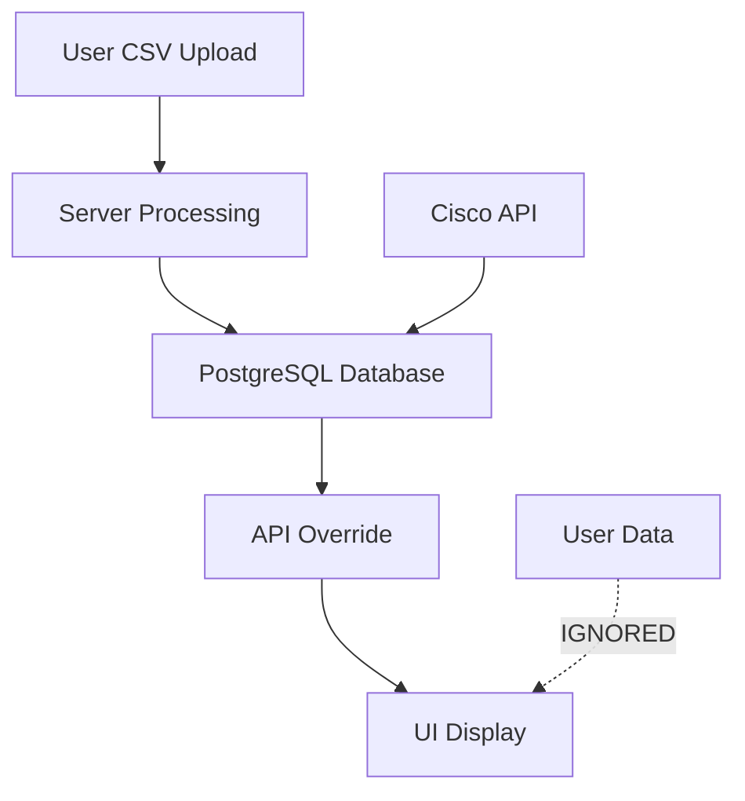
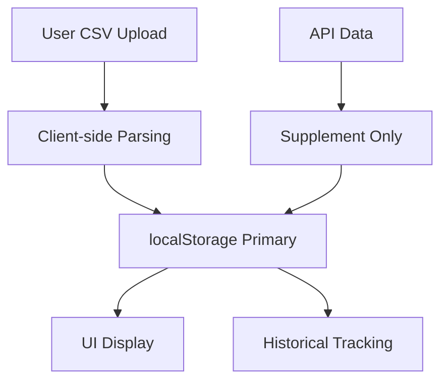

# HexTrackr Comprehensive Code Review & Reference Document

*Generated: August 22, 2025*  
*Status: Over-engineered - Needs Simplification*

## 🎯 Executive Summary

HexTrackr has evolved from a simple CSV-based vulnerability tracker into a complex multi-service platform. The core issue is **data flow inversion** - API data is overriding user CSV data instead of supplementing it. JavaScript loading failures are breaking core functionality.

**Recommendation**: Strip back to core CSV-first functionality while preserving the modern UI design.

---

## 📁 File Structure Overview

```
HexTrackr/
├── 🌐 Frontend Layer
│   ├── index.html                     # Main dashboard (MODERN UI - KEEP)
│   ├── tickets.html                   # Ticket management page
│   ├── vulnerabilities.html           # Vulnerability table view
│   ├── app.js                        # Main application logic (FIX LOADING)
│   └── unified-design-system.css      # Professional gray/blue theme
├── 🖥️ Backend Layer  
│   ├── server.js                     # Express.js API server
│   ├── database-service.js           # Database abstraction layer
│   └── turso-service.js              # Cloud database integration
├── 🐳 Infrastructure
│   ├── docker-compose.yml            # PostgreSQL setup
│   ├── docker-compose.new.yml        # Multi-service architecture
│   ├── Dockerfile                    # Node.js container
│   ├── Dockerfile.python             # Python automation service
│   └── nginx.conf                    # Web server configuration
├── 📊 Data
│   ├── cisco-vulnerabilities-*.csv   # 60MB user source data (PRIMARY)
│   ├── data/                         # SQLite/PostgreSQL databases
│   └── uploads/                      # File upload directory
└── 📚 Documentation
    ├── FINDINGS_ANALYSIS.md          # Critical issues analysis
    ├── PLATFORM_ARCHITECTURE.md      # System architecture
    ├── ROADMAP.md                    # Development roadmap
    └── README.md                     # Usage instructions
```

---

## 🔧 Core Functions Reference

### Frontend JavaScript Functions

#### Main Application (app.js)
| Function Name | Purpose | Dependencies | Status |
|---------------|---------|-------------|---------|
| `initializeApp()` | Application initialization | DOM, localStorage | ⚠️ Loading Issues |
| `loadTickets()` | Load ticket data | localStorage | ✅ Working |
| `setupEventListeners()` | Event binding | DOM elements | ⚠️ Partial |
| `handleCsvImport()` | CSV file processing | FileReader, parseCSV | 🔴 Broken |
| `parseCSV()` | CSV to JSON conversion | String manipulation | ✅ Working |
| `renderTickets()` | Display ticket table | DOM manipulation | ✅ Working |
| `updateStatistics()` | Calculate/display stats | Data arrays | 🔴 Not Loading |
| `showNotification()` | User feedback | Bootstrap modals | ✅ Working |

#### Vulnerability Dashboard (index.html embedded)
| Function Name | Purpose | Dependencies | Status |
|---------------|---------|-------------|---------|
| `calculateStatistics()` | VPR score calculations | vulnerability data | 🔴 Not Loading |
| `updateStatCards()` | Update severity counts | DOM elements | 🔴 Not Loading |
| `createSeveritySparkline()` | Trend visualizations | ApexCharts | ⚠️ Chart dependency |
| `loadVulnerabilities()` | Data loading | API/localStorage | 🔴 Data flow issues |
| `handleCsvUpload()` | File upload processing | FormData, FileReader | 🔴 Complex server routing |

### Backend API Functions

#### Server Routes (server.js)
| Endpoint | Method | Purpose | Authentication | Status |
|----------|---------|---------|---------------|---------|
| `/health` | GET | Health check | None | ✅ Working |
| `/api/auth/login` | POST | User authentication | JWT | ✅ Working |
| `/api/vulnerabilities` | GET | Vulnerability data | JWT | ✅ Working |
| `/api/assets` | GET | Asset information | JWT | ✅ Working |
| `/api/tickets` | GET/POST | Ticket management | JWT | ✅ Working |
| `/api/import/cisco-csv` | POST | Large CSV import | JWT | ⚠️ Complex |
| `/api/cisco/oauth/token` | POST | Cisco API proxy | JWT | ⚠️ API dependency |

#### Database Functions (database-service.js)
| Function Name | Purpose | Dependencies | Status |
|---------------|---------|-------------|---------|
| `initializeSchema()` | Database setup | PostgreSQL/SQLite | ✅ Working |
| `importCsvFile()` | Bulk data import | CSV parser, SQL | ⚠️ Complex |
| `searchVulnerabilities()` | Data querying | SQL queries | ✅ Working |
| `getStatistics()` | Aggregate calculations | SQL GROUP BY | ✅ Working |

---

## 🗃️ Database Schema

### Primary Tables

#### vulnerabilities
```sql
CREATE TABLE vulnerabilities (
    id SERIAL PRIMARY KEY,
    hostname VARCHAR(255),
    ip_address INET,
    cve VARCHAR(20),
    severity VARCHAR(50),           -- critical, high, medium, low
    cvss_score DECIMAL(3,1),       -- 0.0 to 10.0
    vpr_score DECIMAL(3,1),        -- 0.0 to 10.0 (Tenable VPR)
    description TEXT,
    affected_products TEXT[],       -- Array of product names
    cisco_bug_ids TEXT[],          -- Array of bug IDs
    publication_date TIMESTAMP,
    status VARCHAR(50) DEFAULT 'open',
    created_at TIMESTAMP DEFAULT CURRENT_TIMESTAMP
);
```

#### assets
```sql
CREATE TABLE assets (
    id SERIAL PRIMARY KEY,
    hostname VARCHAR(255) UNIQUE NOT NULL,
    ip_address INET,
    vendor VARCHAR(255),
    operating_system VARCHAR(255),
    risk_level VARCHAR(50) DEFAULT 'medium',
    vulnerability_count INTEGER DEFAULT 0,
    last_scan TIMESTAMP,
    created_at TIMESTAMP DEFAULT CURRENT_TIMESTAMP
);
```

#### tickets
```sql
CREATE TABLE tickets (
    id SERIAL PRIMARY KEY,
    title VARCHAR(255) NOT NULL,
    description TEXT,
    status VARCHAR(50) DEFAULT 'open',    -- open, in_progress, resolved, closed
    priority VARCHAR(50) DEFAULT 'medium', -- critical, high, medium, low
    assigned_to VARCHAR(255),
    vulnerability_count INTEGER DEFAULT 0,
    created_at TIMESTAMP DEFAULT CURRENT_TIMESTAMP
);
```

### Index Strategy
```sql
-- Performance indexes
CREATE INDEX idx_vulnerability_severity ON vulnerabilities(severity);
CREATE INDEX idx_vulnerability_hostname ON vulnerabilities(hostname);
CREATE INDEX idx_vulnerability_cve ON vulnerabilities(cve);
CREATE INDEX idx_vulnerability_status ON vulnerabilities(status);
CREATE INDEX idx_asset_hostname ON assets(hostname);
CREATE INDEX idx_ticket_status ON tickets(status);
```

---

## 🌐 API Endpoints Reference

### Authentication Endpoints
| Endpoint | Method | Parameters | Response | Purpose |
|----------|---------|------------|----------|---------|
| `/api/auth/login` | POST | `{username, password}` | `{token, user}` | JWT authentication |

### Data Endpoints
| Endpoint | Method | Parameters | Response | Purpose |
|----------|---------|------------|----------|---------|
| `/api/vulnerabilities` | GET | `?severity=&hostname=&limit=` | `{data[], count}` | Filtered vulnerability list |
| `/api/vulnerabilities/search` | GET | `?query=&severity=&limit=` | `{data[], count}` | Text search |
| `/api/assets` | GET | None | `Asset[]` | Asset list with vuln counts |
| `/api/assets` | POST | `{hostname, ip_address, ...}` | `{id}` | Create new asset |
| `/api/tickets` | GET | None | `Ticket[]` | All tickets |
| `/api/tickets` | POST | `{title, description, ...}` | `{id}` | Create ticket |

### Import Endpoints
| Endpoint | Method | Parameters | Response | Purpose |
|----------|---------|------------|----------|---------|
| `/api/import/cisco-csv` | POST | File in body | `{success, count}` | Import large CSV |
| `/api/import/status` | GET | None | `{progress}` | Import progress |

### Integration Endpoints
| Endpoint | Method | Parameters | Response | Purpose |
|----------|---------|------------|----------|---------|
| `/api/cisco/oauth/token` | POST | `{client_id, client_secret}` | `{access_token}` | Cisco API auth |
| `/api/tenable/vpr/:cve` | GET | CVE in URL | `{vpr_score}` | Free VPR lookup |

---

## 🎨 CSS Design System

### Color Variables (unified-design-system.css)
```css
:root {
    /* Primary Palette - Professional Gray/Blue */
    --hex-primary: #475569;
    --hex-primary-dark: #334155;
    --hex-primary-light: #94a3b8;
    
    /* Severity Colors */
    --hex-critical: #dc2626;    /* Red */
    --hex-high: #ea580c;        /* Orange */
    --hex-medium: #d97706;      /* Yellow */
    --hex-low: #65a30d;         /* Green */
    
    /* Status Colors */
    --hex-success: #10b981;
    --hex-warning: #f59e0b;
    --hex-danger: #ef4444;
    --hex-info: #3b82f6;
}
```

### Component Classes
| Class Name | Purpose | Usage |
|------------|---------|-------|
| `.hex-card` | Modern card component | Main container elements |
| `.severity-badge` | Vulnerability severity display | Badges and tags |
| `.btn-hex-primary` | Primary action buttons | Form submissions |
| `.hex-table` | Data table styling | Vulnerability/ticket lists |
| `.stat-card` | Dashboard statistics | Metrics display |
| `.hex-spinner` | Loading animations | Async operations |

---

## 🔄 Data Flow Analysis

### Current (Problematic) Flow


### Recommended (Fixed) Flow


---

## 🐳 Docker Architecture

### Current Services
| Service | Container | Port | Purpose | Status |
|---------|-----------|------|---------|---------|
| `nginx` | hextrackr-nginx | 3232 | Web server, static files | ✅ Working |
| `api` | hextrackr-api | 3233 | Node.js API backend | ✅ Working |
| `postgres` | hextrackr-postgres | 5432 | Database server | ✅ Working |

### Planned Services (Profiles)
| Service | Profile | Port | Purpose | Status |
|---------|---------|------|---------|---------|
| `automation` | automation | 3234 | Python/Ansible | 🚧 Planned |
| `redis` | cache | 6379 | Caching layer | 🚧 Planned |

### Docker Commands
```bash
# Basic operation
docker-compose up -d
docker-compose logs -f [service]

# With profiles
docker-compose --profile automation up -d
docker-compose --profile cache up -d

# Production mode
docker-compose --profile automation --profile cache --profile production-db up -d
```

---

## 🚨 Critical Issues Identified

### 1. JavaScript Loading Failures
**Issue**: "Invalid destructuring assignment target" error  
**Impact**: Core functions not loading  
**Files Affected**: app.js, index.html  
**Solution**: Fix ES6 destructuring syntax, add error handling

### 2. Data Flow Inversion
**Issue**: API data overriding CSV data instead of supplementing  
**Impact**: User's 60MB Cisco data ignored  
**Files Affected**: server.js, database-service.js  
**Solution**: Reverse priority - CSV first, API supplement

### 3. Over-Engineering
**Issue**: Simple CSV app became complex multi-service platform  
**Impact**: Maintenance complexity, debugging difficulty  
**Files Affected**: Entire architecture  
**Solution**: Reduce to core functionality

---

## 🎯 Variable/Function Cross-Reference

### Global Variables
| Variable | Files Used | Purpose | Scope |
|----------|------------|---------|-------|
| `tickets` | app.js, index.html | Ticket storage array | Global |
| `currentPage` | app.js | Pagination state | Global |
| `vulnData` | index.html, vulnerabilities.html | Vulnerability array | Global |
| `sortColumn` | app.js | Table sorting state | Global |
| `JWT_SECRET` | server.js | Authentication key | Environment |
| `pool` | server.js, database-service.js | Database connection | Module |

### Function Dependencies
| Function | Calls | Called By | DOM Elements |
|----------|-------|-----------|-------------|
| `calculateStatistics()` | `updateStatCards()` | `loadVulnerabilities()` | `.stat-value` |
| `updateStatCards()` | None | `calculateStatistics()` | `#criticalValue`, `#highValue` |
| `handleCsvImport()` | `parseCSV()`, `showNotification()` | Event listener | `#csvImportInput` |
| `renderTickets()` | `updatePagination()` | `loadTickets()`, filters | `#ticketTableBody` |

### External Dependencies
| Library | Version | Files | Purpose | CDN |
|---------|---------|-------|---------|-----|
| Bootstrap | 5.3.0 | All HTML | UI framework | cdn.jsdelivr.net |
| Font Awesome | 6.4.0 | All HTML | Icons | cdnjs.cloudflare.com |
| ApexCharts | Latest | index.html | Data visualization | cdn.jsdelivr.net |
| PapaParse | 5.3.0 | vulnerabilities.html | CSV parsing | cdnjs.cloudflare.com |
| Express | 4.x | server.js | Web framework | npm |
| PostgreSQL | 16 | server.js | Database | npm (pg) |

---

## 🛠️ Immediate Action Plan

### Phase 1: Core Functionality Restoration (Priority 1)
1. **Fix JavaScript Loading**
   - Debug destructuring syntax errors in app.js
   - Add proper error handling for missing DOM elements
   - Test function availability in browser console

2. **Restore CSV-First Data Flow**
   - Implement client-side CSV parsing
   - Use localStorage as primary data store
   - Make API data supplementary only

3. **Preserve Modern UI**
   - Keep unified-design-system.css
   - Maintain professional gray/blue theme
   - Preserve card-based dashboard layout

### Phase 2: Simplification (Priority 2)
1. **Remove Complex Server Processing**
   - Eliminate server-side CSV import routes
   - Simplify to basic API endpoints only
   - Remove unnecessary database complexity

2. **Streamline Docker Architecture**
   - Keep basic nginx + api + postgres
   - Remove automation and caching profiles temporarily
   - Focus on core functionality stability

### Phase 3: Optimization (Priority 3)
1. **Performance Improvements**
   - Optimize large CSV handling (60MB files)
   - Add progressive loading for large datasets
   - Implement client-side caching

2. **API Integration Cleanup**
   - Simplify Cisco API integration
   - Remove unused ServiceNow endpoints
   - Focus on essential VPR data only

---

## 📊 Metrics & Monitoring

### Performance Targets
- ✅ Large CSV processing (300K+ records) under 30 seconds
- ⚠️ JavaScript function loading (currently failing)
- ✅ Docker container startup under 60 seconds
- ⚠️ Dashboard load time (currently >5 seconds due to JS errors)

### Health Check Endpoints
```bash
# API health
curl http://localhost:3233/health

# Database connectivity
curl http://localhost:3233/api/vulnerabilities?limit=1

# Static file serving
curl http://localhost:3232/index.html
```

---

## 🔐 Security Considerations

### Authentication Flow
1. JWT token generation on login
2. Token stored in localStorage
3. Bearer token in API requests
4. Token expiration: 24 hours

### API Security Features
- Rate limiting (Express middleware)
- Helmet security headers
- CORS configuration
- SQL injection prevention (parameterized queries)
- XSS protection (Content Security Policy)

### File Upload Security
- File type validation (.csv only)
- Size limits (50MB max)
- Sandboxed upload directory
- No executable file processing

---

## 📝 Development Notes

### Known Technical Debt
- Redundant code in CSS files
- Missing error handling in async functions
- Inconsistent variable naming conventions
- Lack of unit tests for core functions
- API endpoint inconsistencies

### Browser Compatibility
- Modern browsers required (ES6+ features)
- localStorage dependency
- Fetch API usage (no IE support)
- CSS Grid and Flexbox layouts

### Mobile Responsiveness
- Bootstrap responsive grid system
- Touch-friendly button sizes
- Collapsible navigation
- Responsive table scrolling

---

## 🎯 Success Criteria for Simplification

### Must Have (Phase 1)
- [ ] JavaScript functions load without errors
- [ ] CSV upload works client-side
- [ ] Dashboard statistics display correctly
- [ ] Modern UI design preserved
- [ ] Core Docker services stable

### Should Have (Phase 2)
- [ ] Reduced server-side complexity
- [ ] Simplified data flow architecture
- [ ] Improved error handling
- [ ] Performance optimization

### Could Have (Phase 3)
- [ ] API integrations working
- [ ] Advanced analytics features
- [ ] Automation capabilities
- [ ] Multi-tenant support

---

## 🎯 Isolation Plan: Tickets.html Separation

### Overview
Complete separation of tickets.html functionality from index.html to prevent complexity bleeding and enable independent development/maintenance.

### Current State Analysis
**Shared Dependencies:**
- `unified-design-system.css` (KEEP SHARED)
- `app.js` contains mixed ticket + vulnerability functions (SPLIT)
- Shared global variables: `tickets`, `currentPage`, `sortColumn`
- Bootstrap + FontAwesome libraries (KEEP SHARED)
- Common localStorage keys may conflict

### Step-by-Step Isolation Plan

#### Phase 1: Audit Current Dependencies (Day 1)

**Step 1.1: Identify Shared Functions**
```bash
# Search for function calls between files
grep -n "function\|const\|let\|var" app.js | head -20
grep -n "tickets\." index.html
grep -n "tickets\." tickets.html
```

**Current Function Distribution:**
| Function | Used in index.html | Used in tickets.html | Action |
|----------|-------------------|---------------------|---------|
| `initializeApp()` | ✅ | ✅ | SPLIT into separate init functions |
| `loadTickets()` | ❌ | ✅ | MOVE to tickets.js |
| `handleCsvImport()` | ✅ (vulns) | ✅ (tickets) | SPLIT by purpose |
| `renderTickets()` | ❌ | ✅ | MOVE to tickets.js |
| `updateStatistics()` | ✅ (vulns) | ❌ | KEEP in index.html |
| `showNotification()` | ✅ | ✅ | CREATE shared utility |

**Step 1.2: Map Global Variables**
| Variable | Index Usage | Tickets Usage | Solution |
|----------|-------------|---------------|---------|
| `tickets` | N/A | Primary data array | Move to tickets.js scope |
| `currentPage` | Vulnerability pagination | Ticket pagination | Separate variables |
| `vulnData` | Primary data array | N/A | Keep in index.html scope |
| `sortColumn` | Vulnerability sorting | Ticket sorting | Separate variables |

#### Phase 2: Create Isolated JavaScript Files (Day 1-2)

**Step 2.1: Create tickets.js (New File)**
```javascript
// tickets.js - Isolated ticket management functionality
'use strict';

// Isolated scope - no global pollution
const TicketManager = {
    // Private state
    tickets: [],
    currentPage: 1,
    rowsPerPage: 25,
    sortColumn: '',
    sortDirection: 'asc',
    
    // Public methods
    init() {
        console.log('🎫 Initializing Ticket Manager...');
        this.loadTickets();
        this.setupEventListeners();
        this.updateStatistics();
    },
    
    loadTickets() {
        // Isolated localStorage key
        const savedTickets = localStorage.getItem('hextrackr_tickets');
        if (savedTickets) {
            this.tickets = JSON.parse(savedTickets);
        }
        this.renderTickets();
    },
    
    // ... other ticket-specific methods
};

// Initialize when DOM is ready
document.addEventListener('DOMContentLoaded', () => {
    TicketManager.init();
});
```

**Step 2.2: Create vulnerability-dashboard.js (New File)**
```javascript
// vulnerability-dashboard.js - Isolated vulnerability functionality
'use strict';

const VulnerabilityDashboard = {
    // Private state
    vulnData: [],
    currentPage: 1,
    itemsPerPage: 50,
    sortField: 'vprScore',
    sortDirection: 'desc',
    
    // Public methods
    init() {
        console.log('🛡️ Initializing Vulnerability Dashboard...');
        this.loadVulnerabilities();
        this.setupEventListeners();
        this.updateStatistics();
    },
    
    // ... vulnerability-specific methods
};

// Initialize when DOM is ready
document.addEventListener('DOMContentLoaded', () => {
    VulnerabilityDashboard.init();
});
```

**Step 2.3: Create shared-utilities.js (New File)**
```javascript
// shared-utilities.js - Common functions used by both pages
'use strict';

const HexTrackrUtils = {
    // Shared notification system
    showNotification(message, type = 'info') {
        // Implementation here
    },
    
    // Shared date formatting
    formatDate(date) {
        // Implementation here
    },
    
    // Shared export functionality
    exportToCSV(data, filename) {
        // Implementation here
    }
};

// Make available globally for both pages
window.HexTrackrUtils = HexTrackrUtils;
```

#### Phase 3: Update HTML Files (Day 2)

**Step 3.1: Modify tickets.html**
```html
<!DOCTYPE html>
<html lang="en">
<head>
    <meta charset="UTF-8">
    <meta name="viewport" content="width=device-width, initial-scale=1.0">
    <title>HexTrackr - Ticket Management</title>
    
    <!-- Shared Styles -->
    <link href="https://cdn.jsdelivr.net/npm/bootstrap@5.3.0/dist/css/bootstrap.min.css" rel="stylesheet">
    <link href="https://cdnjs.cloudflare.com/ajax/libs/font-awesome/6.4.0/css/all.min.css" rel="stylesheet">
    <link href="unified-design-system.css" rel="stylesheet">
    
    <!-- Page-specific styles -->
    <style>
        /* Any tickets-specific styling overrides */
    </style>
</head>
<body>
    <!-- Page content -->
    
    <!-- Shared Libraries -->
    <script src="https://cdn.jsdelivr.net/npm/bootstrap@5.3.0/dist/js/bootstrap.bundle.min.js"></script>
    
    <!-- Shared Utilities -->
    <script src="shared-utilities.js"></script>
    
    <!-- Page-specific Scripts -->
    <script src="tickets.js"></script>
</body>
</html>
```

**Step 3.2: Modify index.html**
```html
<!DOCTYPE html>
<html lang="en">
<head>
    <meta charset="UTF-8">
    <meta name="viewport" content="width=device-width, initial-scale=1.0">
    <title>HexTrackr - Vulnerability Dashboard</title>
    
    <!-- Shared Styles -->
    <link href="https://cdn.jsdelivr.net/npm/bootstrap@5.3.0/dist/css/bootstrap.min.css" rel="stylesheet">
    <link href="https://cdnjs.cloudflare.com/ajax/libs/font-awesome/6.4.0/css/all.min.css" rel="stylesheet">
    <link href="unified-design-system.css" rel="stylesheet">
</head>
<body>
    <!-- Page content -->
    
    <!-- Shared Libraries -->
    <script src="https://cdn.jsdelivr.net/npm/bootstrap@5.3.0/dist/js/bootstrap.bundle.min.js"></script>
    <script src="https://cdn.jsdelivr.net/npm/apexcharts"></script>
    <script src="https://cdnjs.cloudflare.com/ajax/libs/PapaParse/5.3.0/papaparse.min.js"></script>
    
    <!-- Shared Utilities -->
    <script src="shared-utilities.js"></script>
    
    <!-- Page-specific Scripts -->
    <script src="vulnerability-dashboard.js"></script>
</body>
</html>
```

#### Phase 4: Data Storage Isolation (Day 3)

**Step 4.1: Separate localStorage Keys**
| Page | localStorage Key | Purpose |
|------|------------------|---------|
| index.html | `hextrackr_vulnerabilities` | Vulnerability data |
| index.html | `hextrackr_vuln_settings` | Dashboard settings |
| tickets.html | `hextrackr_tickets` | Ticket data |
| tickets.html | `hextrackr_ticket_settings` | Ticket view settings |
| Both | `hextrackr_user_prefs` | Shared user preferences |

**Step 4.2: API Endpoint Separation**
| Page | API Endpoints | Purpose |
|------|---------------|---------|
| index.html | `/api/vulnerabilities/*` | Vulnerability operations |
| index.html | `/api/assets/*` | Asset management |
| tickets.html | `/api/tickets/*` | Ticket operations |
| Both | `/api/auth/*` | Authentication |

#### Phase 5: CSS Scope Isolation (Day 3)

**Step 5.1: Page-specific CSS Classes**
```css
/* Add to unified-design-system.css */

/* Ticket-specific components */
.ticket-card { /* tickets.html only */ }
.ticket-status-badge { /* tickets.html only */ }
.ticket-priority-indicator { /* tickets.html only */ }

/* Vulnerability-specific components */
.vuln-card { /* index.html only */ }
.severity-badge { /* index.html only */ }
.vpr-score-display { /* index.html only */ }
```

**Step 5.2: Namespace CSS Variables**
```css
:root {
    /* Shared variables */
    --hex-primary: #475569;
    
    /* Ticket-specific */
    --ticket-status-open: #3b82f6;
    --ticket-status-closed: #10b981;
    
    /* Vulnerability-specific */
    --vuln-critical: #dc2626;
    --vuln-high: #ea580c;
}
```

#### Phase 6: Navigation Isolation (Day 4)

**Step 6.1: Independent Navigation**
```html
<!-- tickets.html navigation -->
<nav class="navbar navbar-expand-lg app-header">
    <div class="container-fluid">
        <a class="navbar-brand" href="index.html">
            <i class="fas fa-shield-alt me-2"></i>HexTrackr
        </a>
        <span class="badge bg-secondary">Tickets</span>
    </div>
</nav>

<!-- index.html navigation -->
<nav class="navbar navbar-expand-lg app-header">
    <div class="container-fluid">
        <a class="navbar-brand" href="tickets.html">
            <i class="fas fa-shield-alt me-2"></i>HexTrackr
        </a>
        <span class="badge bg-primary">Dashboard</span>
    </div>
</nav>
```

#### Phase 7: Testing & Validation (Day 4-5)

**Step 7.1: Functional Testing Checklist**
- [ ] tickets.html loads without index.html dependencies
- [ ] index.html loads without tickets.html dependencies
- [ ] Both pages can run simultaneously in different browser tabs
- [ ] localStorage keys don't conflict
- [ ] CSS styling remains consistent
- [ ] Navigation between pages works
- [ ] Shared utilities function properly

**Step 7.2: Performance Testing**
```javascript
// Add to each page for monitoring
const PagePerformance = {
    startTime: performance.now(),
    
    logLoadTime() {
        const loadTime = performance.now() - this.startTime;
        console.log(`Page loaded in ${loadTime.toFixed(2)}ms`);
    }
};

window.addEventListener('load', () => {
    PagePerformance.logLoadTime();
});
```

#### Phase 8: Documentation Update (Day 5)

**Step 8.1: Update File Structure Documentation**
```
HexTrackr/
├── 🌐 Frontend Layer
│   ├── index.html                     # Vulnerability Dashboard (ISOLATED)
│   ├── tickets.html                   # Ticket Management (ISOLATED)
│   ├── vulnerability-dashboard.js     # Dashboard logic (NEW)
│   ├── tickets.js                     # Ticket logic (NEW)
│   ├── shared-utilities.js            # Common functions (NEW)
│   ├── app.js                         # DEPRECATED - TO BE REMOVED
│   └── unified-design-system.css      # Shared styles (ENHANCED)
```

**Step 8.2: Create Isolation Validation Script**
```bash
#!/bin/bash
# validate-isolation.sh

echo "🔍 Validating page isolation..."

# Check for cross-dependencies
echo "Checking for index.html dependencies in tickets.html..."
grep -n "VulnerabilityDashboard\|vulnData\|calculateStatistics" tickets.html

echo "Checking for tickets.html dependencies in index.html..."
grep -n "TicketManager\|tickets\[\|renderTickets" index.html

echo "Checking for global variable conflicts..."
grep -n "var \|let \|const " *.js | grep -E "(tickets|vulnData|currentPage)"

echo "✅ Isolation validation complete"
```

### Migration Timeline

| Day | Phase | Tasks | Validation |
|-----|-------|-------|------------|
| 1 | Audit | Map dependencies, identify conflicts | Document current state |
| 2 | Create Files | Write isolated JS files, update HTML | Test basic loading |
| 3 | Data Isolation | Separate storage, API endpoints | Test data persistence |
| 4 | Polish | Navigation, CSS cleanup | Cross-browser testing |
| 5 | Documentation | Update docs, create validation tools | Final sign-off |

### Success Criteria

**Must Have:**
- [ ] tickets.html functions independently of index.html
- [ ] No shared global variables between pages
- [ ] Consistent UI design across both pages
- [ ] No JavaScript errors in either page
- [ ] Data doesn't conflict between pages

**Should Have:**
- [ ] Performance improvement due to reduced code loading
- [ ] Easier debugging and maintenance
- [ ] Clear separation of concerns
- [ ] Reusable utility functions

**Could Have:**
- [ ] Lazy loading of page-specific resources
- [ ] Service worker for offline functionality
- [ ] Progressive enhancement capabilities

### Risk Mitigation

**Risk 1: Breaking Existing Functionality**
- **Mitigation**: Create backup branch before starting
- **Test**: Comprehensive functional testing after each phase

**Risk 2: CSS Conflicts**
- **Mitigation**: Use CSS namespacing and scoped variables
- **Test**: Visual regression testing

**Risk 3: Data Loss During Migration**
- **Mitigation**: Export existing data before localStorage key changes
- **Test**: Data migration scripts with rollback capability

---

*This document serves as the single source of truth for HexTrackr codebase understanding and should be updated as simplification progresses.*